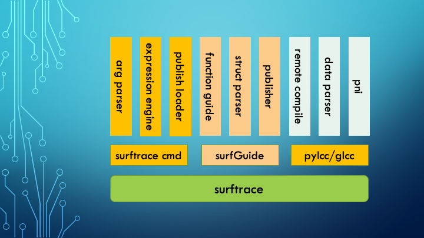
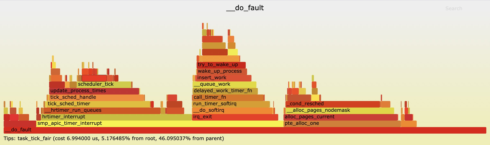
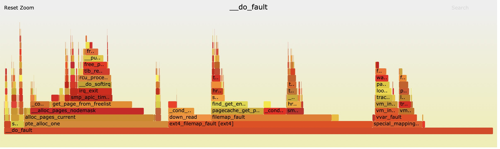
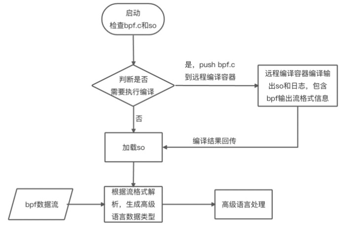
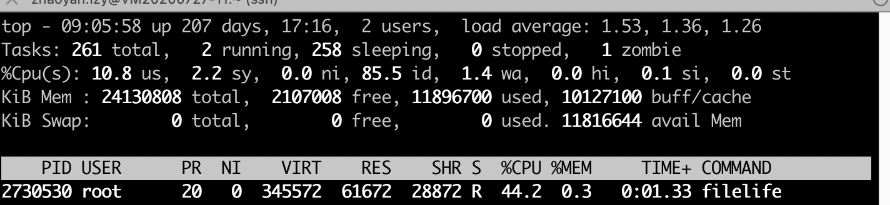

# 1、简介

​&emsp;surftrace是一个ftrace的自动封装器和开发编译平台，既能让用户基于libbpf快速构建工程进行开发，也能作为ftrace的封装器进行trace命令编写。项目包含surftrace工具集和pylcc、glcc(python or generic C language for libbpf Compiler Collection)，提供远程和本地eBPF的编译能力。



## 1.1、ftrace原理与不足

​&emsp;ftrace是一个内核中的追踪器，用于帮助系统开发者或设计者查看内核运行情况，它可以被用来调试或者分析延迟/性能等常见问题。早期 ftrace 是一个 function tracer，仅能够记录内核的函数调用流程。如今ftrace已经成为一个开发框架，从2.6内核开始引入，是一套公认安全、可靠、高效的内核数据获取方式。

​&emsp;ftrace对使用者的要求比较高，以对内核符号 wake\_up\_new\_task 进行trace，同时要获取入参(struct task\_struct *)->comm 成员信息为例，启动配置需要经历三个步骤：

```bash
echo 'p:f0 wake_up_new_task comm=+0x678(%di):string' >> /sys/kernel/debug/tracing/kprobe_events
echo 1 > /sys/kernel/debug/tracing/instances/surftrace/events/kprobes/f0/enable
echo 1 > /sys/kernel/debug/tracing/instances/surftrace/tracing_on
```

​&emsp;要想停止需要继续配置如下：

```bash
echo 0 > /sys/kernel/debug/tracing/instances/surftrace/events/kprobes/f0/enable
echo -:f0 >> /sys/kernel/debug/tracing/kprobe_events
echo 0 > /sys/kernel/debug/tracing/instances/surftrace/tracing_on
```

​&emsp;一共需要六个步骤。其中，最困难的是第一个参数解析步骤。通常情况下，需要使用gdb 加载对应内核vmlinux， 对 struct task_struct 结构体中 comm成员进行偏移计算。上述方法如果不经常使用，重新手工操作的时间成本非常高，导致真正直接采用ftrace对内核信息进行采集的案例非常少，相关资料文献也匮乏。

## 1.2、surftrace目标

​&emsp;surftrace的主要目标是为了降低内核trace难度，达到快速高效获取内核信息目标。综合来说要达到以下效果：

- 1. 一键trace内核符号，并获取指定内核数据；
- 2. 除了C和linux 操作系统内核，用户无需新增学习掌握其它知识点（需要获取数据进行二次处理除外）；
- 3. 覆盖大部分主流发行版内核；
-  4. 类似bcc开发模式，达到libbpf最佳资源消耗；

# 2、surftrace 命令使用

​&emsp;使用surftrace，需要满足以下条件：

- 1. 公开发行版linux内核，支持目录清单参考：http://mirrors.openanolis.cn/coolbpf/db/  （持续更新）
- 2. 内核支持ftrace，已配置了debugfs，root权限；
- 3. Python2 >= 2.7; Python3 >= 3.5，已安装pip；

​	surftrace支持 remote（默认），local和gdb三种表达式解析器，要求分别如下：

- 1. remote mode：可以访问pylcc.openanolis.cn
- 2. local mode：从http://pylcc.openanolis.cn/db/ 下载对应arch和内核的下载到本地
- 3. gdb mode：gdb version > 8.0，存放有对应内核的vmlinux；对于gdb模式而言，不受公开发行版内核限制(性能太弱，已经不再推荐)

## 2.1、安装

​&emsp;我们以龙蜥 4.19.91-24.8.an8.x86_64内核为例，需要root用户，执行以下命令进行安装：

```
pip3 install surftrace
Collecting surftrace
  Downloading http://mirrors.cloud.aliyuncs.com/pypi/packages/b9/a2/f7e04bb8ebb12e6517162a70886e3ffe8d466437b15624590c9301fdcc52/surftrace-0.2.tar.gz
Building wheels for collected packages: surftrace
  Running setup.py bdist_wheel for surftrace ... done
  Stored in directory: /root/.cache/pip/wheels/cf/28/93/187f359be189bf0bf4a70197c53519c6ca54ffb957bcbebf5a
Successfully built surftrace
Installing collected packages: surftrace
Successfully installed surftrace-0.2
```

&emsp;0.6以上（含）的版本采用https流的方式与服务器传输数据，低于0.6版本采用tcp 流传输。后者服务将从2023年12月31号起后下线。

​&emsp;检查安装是否成功

```
surftrace --help
usage: surftrace [-h] [-v VMLINUX] [-m MODE] [-d DB] [-r RIP] [-f FILE]
                 [-g GDB] [-F FUNC] [-o OUTPUT] [-l LINE] [-a ARCH] [-s] [-S]
                 [traces [traces ...]]

Trace ftrace kprobe events.

positional arguments:
  traces                set trace args.

optional arguments:
  -h, --help            show this help message and exit
  -v VMLINUX, --vmlinux VMLINUX
                        set vmlinux path.
  -m MODE, --mode MODE  set arg parser, fro
  -d DB, --db DB        set local db path.
  -r RIP, --rip RIP     set remote server ip, remote mode only.
  -f FILE, --file FILE  set input args path.
  -g GDB, --gdb GDB     set gdb exe file path.
  -F FUNC, --func FUNC  disasassemble function.
  -o OUTPUT, --output OUTPUT
                        set output bash file
  -l LINE, --line LINE  get file disasemble info
  -a ARCH, --arch ARCH  set architecture.
  -s, --stack           show call stacks.
  -S, --show            only show expressions.

examples:
```

## 2.2、常规函数入口trace

​&emsp;接下来我们以 以下两个常用内核符号为例，它的原型定义如下：

```c
void wake_up_new_task(struct task_struct *p);
struct file *do_filp_open(int dfd, struct filename *pathname, const struct open_flags *op);
```

### 2.2.1、追踪符号入口和返回点

- 命令：surftrace 'p wake_up_new_task' 'r wake_up_new_task'

```bash
surftrace 'p wake_up_new_task' 'r wake_up_new_task'
echo 'p:f0 wake_up_new_task' >> /sys/kernel/debug/tracing/kprobe_events
echo 1 > /sys/kernel/debug/tracing/instances/surftrace/events/kprobes/f0/enable
echo 'r:f1 wake_up_new_task' >> /sys/kernel/debug/tracing/kprobe_events
echo 1 > /sys/kernel/debug/tracing/instances/surftrace/events/kprobes/f1/enable
echo 0 > /sys/kernel/debug/tracing/instances/surftrace/options/stacktrace
echo 1 > /sys/kernel/debug/tracing/instances/surftrace/tracing_on
 surftrace-2336  [001] ....  1447.877666: f0: (wake_up_new_task+0x0/0x280)
 surftrace-2336  [001] d...  1447.877670: f1: (_do_fork+0x153/0x3d0 <- wake_up_new_task)
```

​&emsp;示例中入参有两个表达式，所有表达式要用单引号括起来。

- 'p wake_up_new_task'：p表示表示probe函数入口；
- 'r wake_up_new_task'：r表示probe函数返回位置；

​&emsp;后面的wake_up_new_task是要trace的函数符号，这个符号必须要在tracing/available_filter_functions 中可以找到的。

### 2.2.2、获取函数入参

​&emsp;要获取 do_filp_open 函数 第一个入参dfd，它的数据类型是：int。

​- 命令：surftrace 'p do_filp_open dfd=%0'

```bash
surftrace 'p do_filp_open dfd=%0'
echo 'p:f0 do_filp_open dfd=%di:u32' >> /sys/kernel/debug/tracing/kprobe_events
echo 1 > /sys/kernel/debug/tracing/instances/surftrace/events/kprobes/f0/enable
echo 0 > /sys/kernel/debug/tracing/instances/surftrace/options/stacktrace
echo 1 > /sys/kernel/debug/tracing/instances/surftrace/tracing_on
 surftrace-2435  [001] ....  2717.606277: f0: (do_filp_open+0x0/0x100) dfd=4294967196
 AliYunDun-1812  [000] ....  2717.655955: f0: (do_filp_open+0x0/0x100) dfd=4294967196
 AliYunDun-1812  [000] ....  2717.856227: f0: (do_filp_open+0x0/0x100) dfd=4294967196
```

- dfd是自定义变量，可以自行定义，名字不冲突即可
- %0表示第一个入参，%1表示第二个……


​&emsp;前面打印中，dfd是按照十进制显示的，可能没有十六进制那么直观，指定十六进制的方法：

​&emsp;命令：surftrace 'p do_filp_open dfd=X%0'

```
surftrace 'p do_filp_open dfd=X%0'
echo 'p:f0 do_filp_open dfd=%di:x32' >> /sys/kernel/debug/tracing/kprobe_events
echo 1 > /sys/kernel/debug/tracing/instances/surftrace/events/kprobes/f0/enable
echo 0 > /sys/kernel/debug/tracing/instances/surftrace/options/stacktrace
echo 1 > /sys/kernel/debug/tracing/instances/surftrace/tracing_on
 surftrace-2459  [000] ....  3137.167885: f0: (do_filp_open+0x0/0x100) dfd=0xffffff9c
 AliYunDun-1812  [001] ....  3137.171997: f0: (do_filp_open+0x0/0x100) dfd=0xffffff9c
 AliYunDun-1826  [001] ....  3137.201401: f0: (do_filp_open+0x0/0x100) dfd=0xffffff9c
```

​&emsp;传参编号%前面使用了X进制类型标识符，共有SUX三种类型，分别对应有符号十进制、无符号十进制和十六进制，不指定默认为U类型。

### 2.2.3、解析入参结构体

​&emsp;wake_up_new_task入参类型为struct task_struct *，如果要获取入参中comm成员，即任务名，

​- 命令：surftrace 'p wake_up_new_task comm=%0->comm'

```bash
surftrace 'p wake_up_new_task comm=%0->comm'
echo 'p:f0 wake_up_new_task comm=+0xae0(%di):string' >> /sys/kernel/debug/tracing/kprobe_events
echo 1 > /sys/kernel/debug/tracing/instances/surftrace/events/kprobes/f0/enable
echo 0 > /sys/kernel/debug/tracing/instances/surftrace/options/stacktrace
echo 1 > /sys/kernel/debug/tracing/instances/surftrace/tracing_on
 surftrace-2421  [000] ....  2368.261019: f0: (wake_up_new_task+0x0/0x280) comm="surftrace"
 bash-2392  [001] ....  2375.809655: f0: (wake_up_new_task+0x0/0x280) comm="bash"
 bash-2392  [001] ....  2379.038534: f0: (wake_up_new_task+0x0/0x280) comm="bash"
 bash-2392  [000] ....  2381.237443: f0: (wake_up_new_task+0x0/0x280) comm="bash"
```

​&emsp;方法和C语言获取结构体成员方法一样。

​&emsp;结构体类型可以级联访问：

```bash
 surftrace 'p wake_up_new_task uesrs=S%0->mm->mm_users'
echo 'p:f0 wake_up_new_task uesrs=+0x58(+0x850(%di)):s32' >> /sys/kernel/debug/tracing/kprobe_events
echo 1 > /sys/kernel/debug/tracing/instances/surftrace/events/kprobes/f0/enable
echo 0 > /sys/kernel/debug/tracing/instances/surftrace/options/stacktrace
echo 1 > /sys/kernel/debug/tracing/instances/surftrace/tracing_on
 surftrace-2471  [001] ....  3965.234680: f0: (wake_up_new_task+0x0/0x280) uesrs=2
 bash-2392  [000] ....  3970.094475: f0: (wake_up_new_task+0x0/0x280) uesrs=1
 bash-2392  [000] ....  3971.954463: f0: (wake_up_new_task+0x0/0x280) uesrs=1
```

```bash
surftrace 'p wake_up_new_task node=%0->se.run_node.rb_left'
echo 'p:f0 wake_up_new_task node=+0xa8(%di):u64' >> /sys/kernel/debug/tracing/kprobe_events
echo 1 > /sys/kernel/debug/tracing/instances/surftrace/events/kprobes/f0/enable
echo 0 > /sys/kernel/debug/tracing/instances/surftrace/options/stacktrace
echo 1 > /sys/kernel/debug/tracing/instances/surftrace/tracing_on
 surftrace-2543  [001] ....  5926.605145: f0: (wake_up_new_task+0x0/0x280) node=0
 bash-2392  [001] ....  5940.292293: f0: (wake_up_new_task+0x0/0x280) node=0
 bash-2392  [001] ....  5945.207106: f0: (wake_up_new_task+0x0/0x280) node=0
 systemd-journal-553   [000] ....  5953.211998: f0: (wake_up_new_task+0x0/0x280) node=0
```

### 2.2.4、设置过过滤器

​&emsp;过滤器需要放在表达式最后，以f:开头，可以使用括号和&& ||逻辑表达式进行组合，具体写法可以参考ftrace文档说明

​&emsp;命令行 surftrace 'p wake_up_new_task comm=%0->comm f:comm=="python3"'

```bash
surftrace 'p wake_up_new_task comm=%0->comm f:comm=="python3"'
echo 'p:f0 wake_up_new_task comm=+0xb28(%di):string' >> /sys/kernel/debug/tracing/kprobe_events
echo 'comm=="python3"' > /sys/kernel/debug/tracing/instances/surftrace/events/kprobes/f0/filter
echo 1 > /sys/kernel/debug/tracing/instances/surftrace/events/kprobes/f0/enable
echo 0 > /sys/kernel/debug/tracing/instances/surftrace/options/stacktrace
echo 1 > /sys/kernel/debug/tracing/instances/surftrace/tracing_on
 <...>-2640781 [002] .... 6305734.444913: f0: (wake_up_new_task+0x0/0x250) comm="python3"
 <...>-2640781 [002] .... 6305734.447806: f0: (wake_up_new_task+0x0/0x250) comm="python3"
 <...>-2640781 [002] .... 6305734.450897: f0: (wake_up_new_task+0x0/0x250) comm="python3"
```

&emsp;系统会默认提供 'common_pid', 'common_preempt_count', 'common_flags', 'common_type' 这5个变量作为过滤器，该变量由系统提供，无需额外定义。

### 2.2.5、函数内部追踪

​&emsp;函数内部追踪需要结合函数内部汇编代码进行推导，该方法并不通用，该内容操作进供参考。反汇编do_filp_open函数

```asm
3699	in fs/namei.c
   0xffffffff812adb65 <+85>:	mov    %r13d,%edx
   0xffffffff812adb70 <+96>:	or     $0x40,%edx
   0xffffffff812adb73 <+99>:	mov    %r12,%rsi
   0xffffffff812adb76 <+102>:	mov    %rsp,%rdi
   0xffffffff812adb89 <+121>:	callq  0xffffffff812ac760 <path_openat>
   0xffffffff812adb92 <+130>:	mov    %rax,%rbx

3700	in fs/namei.c
   0xffffffff812adb8e <+126>:	cmp    $0xfffffffffffffff6,%rax
   0xffffffff812adb95 <+133>:	je     0xffffffff812adbb4 <do_filp_open+164>

3701	in fs/namei.c
   0xffffffff812adbb4 <+164>:	mov    %r13d,%edx
   0xffffffff812adbb7 <+167>:	mov    %r12,%rsi
   0xffffffff812adbba <+170>:	mov    %rsp,%rdi
   0xffffffff812adbbd <+173>:	callq  0xffffffff812ac760 <path_openat>
   0xffffffff812adbc2 <+178>:	mov    %rax,%rbx
   0xffffffff812adbc5 <+181>:	jmp    0xffffffff812adb97 <do_filp_open+135>

3702	in fs/namei.c
   0xffffffff812adb97 <+135>:	cmp    $0xffffffffffffff8c,%rbx
   0xffffffff812adb9b <+139>:	je     0xffffffff812adbc7 <do_filp_open+183>
```

&emsp;对应源码

```c
struct file *do_filp_open(int dfd, struct filename *pathname,
  		const struct open_flags *op)
{
  	struct nameidata nd;
  	int flags = op->lookup_flags;
  	struct file *filp;
  
  	set_nameidata(&nd, dfd, pathname);
  	filp = path_openat(&nd, op, flags | LOOKUP_RCU);
  	if (unlikely(filp == ERR_PTR(-ECHILD)))
  		filp = path_openat(&nd, op, flags);
  	if (unlikely(filp == ERR_PTR(-ESTALE)))
  		filp = path_openat(&nd, op, flags | LOOKUP_REVAL);
  	restore_nameidata();
  	return filp;
}
```

&emsp;要获取 3699行 filp = path_openat(&nd, op, flags | LOOKUP_RCU) 对应的filp的值


```bash
surftrace 'p do_filp_open+121 filp=X!(u64)%ax'
echo 'p:f0 do_filp_open+121 filp=%ax:x64' >> /sys/kernel/debug/tracing/kprobe_events
echo 1 > /sys/kernel/debug/tracing/instances/surftrace/events/kprobes/f0/enable
echo 0 > /sys/kernel/debug/tracing/instances/surftrace/options/stacktrace
echo 1 > /sys/kernel/debug/tracing/instances/surftrace/tracing_on
 <...>-1315799 [006] d.Z. 6314249.201847: f0: (do_filp_open+0x79/0xd0) filp=0xffff929db2819840
 <...>-4006158 [014] d.Z. 6314249.326736: f0: (do_filp_open+0x79/0xd0) filp=0xffff929daeac48c0
```

&emsp;变量表达式：filp=X!(u64)%ax 中，使用!对寄存器类型进行数据类型强制转换，括号当中的是是数据类型定义。

&emsp;展开 struct file 结构体定义：

```c
struct file {
    union {
        struct llist_node fu_llist;
        struct callback_head fu_rcuhead;
    } f_u;
    struct path f_path;
    struct inode *f_inode;
    const struct file_operations *f_op;
    spinlock_t f_lock;
    enum rw_hint f_write_hint;
    atomic_long_t f_count;
    unsigned int f_flags;
    fmode_t f_mode;
    struct mutex f_pos_lock;
    loff_t f_pos;
    struct fown_struct f_owner;
    const struct cred *f_cred;
    struct file_ra_state f_ra;
    u64 f_version;
    void *f_security;
    void *private_data;
    struct list_head f_ep_links;
    struct list_head f_tfile_llink;
    struct address_space *f_mapping;
    errseq_t f_wb_err;
}
```

​&emsp;如果要获取此时的f_pos值，可以这样获取

- 命令行：surftrace 'p do_filp_open+121 pos=X!(struct file*)%ax->f_pos'

```bash
surftrace 'p do_filp_open+121 pos=X!(struct file*)%ax->f_pos'
echo 'p:f0 do_filp_open+121 pos=+0x68(%ax):x64' >> /sys/kernel/debug/tracing/kprobe_events
echo 1 > /sys/kernel/debug/tracing/instances/surftrace/events/kprobes/f0/enable
echo 0 > /sys/kernel/debug/tracing/instances/surftrace/options/stacktrace
echo 1 > /sys/kernel/debug/tracing/instances/surftrace/tracing_on
 <...>-1334277 [010] d.Z. 6314645.646230: f0: (do_filp_open+0x79/0xd0) pos=0x0
 <...>-2916553 [002] d.Z. 6314645.653164: f0: (do_filp_open+0x79/0xd0) pos=0x0
 <...>-2916553 [002] d.Z. 6314645.653253: f0: (do_filp_open+0x79/0xd0) pos=0x0
```

&emsp;获取方法和前面保持一致。

## 2.3、获取返回值

​&emsp;前文已经描述采用r 对事件类型进行标识，返回寄存器统一用\$retval标识，与ftrace保持一致，以获取do_filp_open函数返回值为例：

- 命令行：surftrace 'r do_filp_open filp=$retval'

```bash
surftrace 'r do_filp_open filp=$retval'
echo 'r:f0 do_filp_open filp=$retval:u64' >> /sys/kernel/debug/tracing/kprobe_events
echo 1 > /sys/kernel/debug/tracing/instances/surftrace/events/kprobes/f0/enable
echo 0 > /sys/kernel/debug/tracing/instances/surftrace/options/stacktrace
echo 1 > /sys/kernel/debug/tracing/instances/surftrace/tracing_on
 <...>-1362926 [010] d... 6315264.198718: f0: (do_sys_openat2+0x1b6/0x260 <- do_filp_open) filp=18446623804769722880
 <...>-4006154 [008] d... 6315264.256749: f0: (do_sys_openat2+0x1b6/0x260 <- do_filp_open) filp=18446623804770426624
 <...>-4006154 [008] d... 6315264.256776: f0: (do_sys_openat2+0x1b6/0x260 <- do_filp_open) filp=18446623804770425344
```

​&emsp;获取 struct file 中f_pos成员

- 命令行：surftrace 'r do_filp_open pos=\$retval->f_pos'

```bash
surftrace 'r do_filp_open pos=$retval->f_pos'
echo 'r:f0 do_filp_open pos=+0x68($retval):u64' >> /sys/kernel/debug/tracing/kprobe_events
echo 1 > /sys/kernel/debug/tracing/instances/surftrace/events/kprobes/f0/enable
echo 0 > /sys/kernel/debug/tracing/instances/surftrace/options/stacktrace
echo 1 > /sys/kernel/debug/tracing/instances/surftrace/tracing_on
 <...>-1371049 [008] d... 6315439.568814: f0: (do_sys_openat2+0x1b6/0x260 <- do_filp_open) pos=0
 systemd-journal-3665  [012] d... 6315439.568962: f0: (do_sys_openat2+0x1b6/0x260 <- do_filp_open) pos=0
 systemd-journal-3665  [012] d... 6315439.571519: f0: (do_sys_openat2+0x1b6/0x260 <- do_filp_open) pos=0
```

## 2.4、网络报文特殊处理

​&emsp;sk_buff 是linux网络协议栈重要的结构体，通过前面的方法，并不能直接解析到我们关注的报文内容，需要进行特殊处理。以追踪icmp接收ping报文为例，我们在__netif_receive_skb_core 函数中进行probe和过滤:

- 命令行 surftrace 'p __netif_receive_skb_core proto=@(struct iphdr \*)l3%0->protocol ip_src=@(struct iphdr \*)%0->saddr ip_dst=@(struct iphdr \*)l3%0->daddr data=X@(struct iphdr *)l3%0->sdata[1] f:proto==1&&ip_src==127.0.0.1'
- 同时可能需要 执行 ping127.0.0.1

```bash
surftrace 'p __netif_receive_skb_core proto=@(struct iphdr *)l3%0->protocol ip_src=@(struct iphdr *)%0->saddr ip_dst=@(struct iphdr *)l3%0->daddr data=X@(struct iphdr *)l3%0->sdata[1] f:proto==1&&ip_src==127.0.0.1'
echo 'p:f0 __netif_receive_skb_core proto=+0x9(+0xe8(%di)):u8 ip_src=+0xc(+0xe8(%di)):u32 ip_dst=+0x10(+0xe8(%di)):u32 data=+0x16(+0xe8(%di)):x16' >> /sys/kernel/debug/tracing/kprobe_events
echo 'proto==1&&ip_src==0x100007f' > /sys/kernel/debug/tracing/instances/surftrace/events/kprobes/f0/filter
echo 1 > /sys/kernel/debug/tracing/instances/surftrace/events/kprobes/f0/enable
echo 0 > /sys/kernel/debug/tracing/instances/surftrace/options/stacktrace
echo 1 > /sys/kernel/debug/tracing/instances/surftrace/tracing_on
 <...>-1420827 [013] ..s1 6316511.011244: f0: (__netif_receive_skb_core+0x0/0xc10) proto=1 ip_src=127.0.0.1 ip_dst=127.0.0.1 data=0x4a0d
 <...>-1420827 [013] ..s1 6316511.011264: f0: (__netif_receive_skb_core+0x0/0xc10) proto=1 ip_src=127.0.0.1 ip_dst=127.0.0.1 data=0x4a15
```

​&emsp;协议的获取表达式为 @(struct iphdr *)l3%0->protocol，和之前不一样的是，寄存器的结构体名左括号加了@符号进行特殊标记，表示需要用该结构体来解析skb->data指针数据，结构体名和右括号后加了l3标记（命名为右标记），表示当前skb->data指向了TCP/IP 层3位置。

- 右标记有l2、l3、l4三个选项，也可以不标记，默认为l3，如 ip_src=@(struct iphdr *)%0->saddr，没有右标记。
- 报文结构体有 'struct ethhdr', 'struct iphdr', 'struct icmphdr', 'struct tcphdr', 'struct udphdr'五类，如果协议栈层级和报文结构体对应不上，解析器会报参数错误，如右标记为l3，但是报文结构体是 struct ethhdr类型；
- 'struct icmphdr', 'struct tcphdr', 'struct udphdr'这三个4层结构体增加了xdata成员，用于获取协议对应报文内容。xdata有 cdata. sdata, ldata, qdata, Sdata 五种类型，位宽对应 1 2 4 8 和字符串. 数组下标是按照位宽进行对齐的，如实例表达式中的 data=@(struct icmphdr*)l3%0->sdata[1],sdata[1]表示要提取icmp报文中的2~3字节内容
- surftrace 会对以 ip_xx开头的变量进行ipv4<->u32 ，如 ip_src=@(struct iphdr *)%0->saddr，会转成对应的IP格式。对B16_、B32_、B64_、b16_、b32_、b64_开头的变量也会进行大小端转换，B开头按照16进制输出，b以10进制输出。

## 2.5、event

​&emsp;trace event 信息参考 /sys/kernel/debug/tracing/events目录下的事件 描述，以追踪wakeup等待超过10ms任务为例

​&emsp;命令行 surftrace 'e sched/sched_stat_wait f:delay>1000000'

```bash
surftrace 'e sched/sched_stat_wait f:delay>1000000'
echo 'delay>1000000' > /sys/kernel/debug/tracing/instances/surftrace/events/sched/sched_stat_wait/filter
echo 1 > /sys/kernel/debug/tracing/instances/surftrace/events/sched/sched_stat_wait/enable
echo 0 > /sys/kernel/debug/tracing/instances/surftrace/options/stacktrace
echo 1 > /sys/kernel/debug/tracing/instances/surftrace/tracing_on
<idle>-0     [001] dN.. 11868700.419049: sched_stat_wait: comm=h2o pid=3046552 delay=87023763 [ns]
 <idle>-0     [005] dN.. 11868700.419049: sched_stat_wait: comm=h2o pid=3046617 delay=87360020 [ns]
```
## 2.6、全局变量以及指定地址访问
### 2.6.1、访问内核符号：
&emsp;以访问 task\_group\_cache 这个全局符号为例，它的定义如下：

```c
static struct kmem_cache *task_group_cache __read_mostly;
```

&emsp;获取指针信息

```bash
surftrace 'p wake_up_new_task point=@task_group_cache'
echo 'p:f0 wake_up_new_task point=@task_group_cache' >> /sys/kernel/debug/tracing/kprobe_events
echo 1 > /sys/kernel/debug/tracing/instances/surftrace/events/kprobes/f0/enable
echo 0 > /sys/kernel/debug/tracing/instances/surftrace/options/stacktrace
echo 1 > /sys/kernel/debug/tracing/instances/surftrace/tracing_on
 <...>-3626383 [000] .... 12192156.289170: f0: (wake_up_new_task+0x0/0x250) point=0xffff929dc0405500
 <...>-2282088 [006] .... 12192156.294148: f0: (wake_up_new_task+0x0/0x250) point=0xffff929dc0405500
 <...>-3626558 [001] .... 12192156.305044: f0: (wake_up_new_task+0x0/0x250) point=0xffff929dc0405500
 <...>-3626558 [001] .... 12192156.305133: f0: (wake_up_new_task+0x0/0x250) point=0xffff929dc0405500
```

&emsp;解析变量结构体内容：

```bash
surftrace 'p wake_up_new_task name=!(struct kmem_cache*)@task_group_cache->name size=!(struct kmem_cache*)@task_group_cache->size'
echo 'p:f0 wake_up_new_task name=+0x0(+0x58(@task_group_cache)):string size=+0x18(@task_group_cache):u32' >> /sys/kernel/debug/tracing/kprobe_events
echo 1 > /sys/kernel/debug/tracing/instances/surftrace/events/kprobes/f0/enable
echo 0 > /sys/kernel/debug/tracing/instances/surftrace/options/stacktrace
echo 1 > /sys/kernel/debug/tracing/instances/surftrace/tracing_on
 <...>-3736660 [014] .... 12192459.242704: f0: (wake_up_new_task+0x0/0x250) name="task_group" size=704
 <...>-2282088 [008] .... 12192459.266579: f0: (wake_up_new_task+0x0/0x250) name="task_group" size=704
 <...>-3736816 [001] .... 12192459.278101: f0: (wake_up_new_task+0x0/0x250) name="task_group" size=704
 <...>-3736816 [001] .... 12192459.278169: f0: (wake_up_new_task+0x0/0x250) name="task_group" size=704
```

### 2.6.2、访问指定地址
&emsp;根据ftrace要求，访问地址必须要在内核地址范围内。继续以以访问 task\_group\_cache 这个全局符号为例，首先获取符号地址

```bash
cat /proc/kallsyms |grep task_group_cache
ffffffff8647bc30 d task_group_cache
```
&emsp;查询命令（注意，不同内核地址不一致，不能简单复制）：

```bah
surftrace 'p wake_up_new_task name=!(struct kmem_cache*)@0xffffffff8647bc30->name size=!(struct kmem_cache*)@0xffffffff8647bc30->size'
echo 'p:f0 wake_up_new_task name=+0x0(+0x58(@0xffffffff8647bc30)):string size=+0x18(@0xffffffff8647bc30):u32' >> /sys/kernel/debug/tracing/kprobe_events
echo 1 > /sys/kernel/debug/tracing/instances/surftrace/events/kprobes/f0/enable
echo 0 > /sys/kernel/debug/tracing/instances/surftrace/options/stacktrace
echo 1 > /sys/kernel/debug/tracing/instances/surftrace/tracing_on
 <...>-3910607 [012] .... 12193362.784157: f0: (wake_up_new_task+0x0/0x250) name="task_group" size=704
 <...>-3386586 [012] .... 12193362.960034: f0: (wake_up_new_task+0x0/0x250) name="task_group" size=704
 <...>-3386586 [012] .... 12193362.963222: f0: (wake_up_new_task+0x0/0x250) name="task_group" size=704
```

## 2.7、自编ko支持
&emsp;如果需要trace自定义ko，但是默认的数据结构信息只包含发行版中rpm/deb包中的数据。需要生成自定义ko的数据。

### 2.7.1、生成本地数据：
&emsp;要求：  

1. surftrace版本不低于0.7.1，可执行pip install -U surftrace 命令进行更新；
2. 要追踪的ko放在同一目录下，并且没有strip掉调试信息；

&emsp;生成过程比较简单，将ko所在目录作为唯一传参，传kobuild，就可以在当前目录下生成prev.db 文件：  

```bash
#kobuild ko/
#ll -h prev.db
-rw-r--r-- 1 root root 592K May 29 00:10 prev.db
```
&emsp;出于效率和尺寸考虑，kobuild会将ko数量限制在32个，总文件大小小于16M，大于此数值会报失败。
### 2.7.2、使用prev.db：
&emsp;可以采用以下两种方式使用prev.db 数据：  

1. 在prev.db 所在的目录下 执行surftrace相关操作；
2. export LBC_PREVDB 环境变量，指向prev.db 完整路径，含文件名；
 
&emsp;此时surftrace会优先检索prev.db中的数据，检索失败后才会进行远端/本地搜索结构信息。

## 2.8、符号调用过程追踪（surfGraph/function_graph）
&emsp;调用过程追踪(surfGraph)可以将一个内核函数的内部调用流程和各个阶段耗时直观呈现出来。对一下场景尤为有帮助：

1. 了解函数调用关系；
2. 定位内核性能问题；

&emsp;注意事项和使用约束：

1. 目标符号在内核符号范围内
2. 全局追踪，不支持过滤器
3. 高频调用的符号会消耗较高的cpu资源，可能导致追踪失败。

### 2.8.1、命令说明

```
usage: surfGraph [-h] [-f FUNCTION] [-m MODE] [-s STEP] [-o OUTPUT]

kernel function call graph tool.

optional arguments:
  -h, --help            show this help message and exit
  -f FUNCTION, --function FUNCTION
                        set function to call graph.
  -m MODE, --mode MODE  set output mode, support svg(default)/tree/walk/raw
  -s STEP, --step STEP  write file by every step, only for svg mode.
  -o OUTPUT, --output OUTPUT
                        save trees to *.tree file, 32 max

examples: surfGraph -f __do_fault
```

### 2.8.2、使用示例
&emsp;以追踪 __do_fault 符号为例，在环境下执行以下命令：

```
#surfGraph -f __do_fault
echo nop > /sys/kernel/debug/tracing/current_tracer
echo __do_fault > /sys/kernel/debug/tracing/set_graph_function
echo function_graph > /sys/kernel/debug/tracing/current_tracer
echo 1 > /sys/kernel/debug/tracing/tracing_on
save __do_fault-1.svg
save __do_fault-2.svg
save __do_fault-3.svg
save __do_fault-4.svg
……
save __do_fault-241.svg
^Csave __do_fault-242.svg
echo 0 > /sys/kernel/debug/tracing/tracing_on
echo  > /sys/kernel/debug/tracing/set_graph_function
write __do_fault.svg
```

&emsp;此时会在命令所在目录生成符号对应的火焰图文件。单个火焰图的文件格式为[symbol]-[serial].svg，总火焰图文件格式为 [symbol].svg。任意一次火焰图的效果：



&emsp;总火焰图




## 2.9 用户态追踪 uprobe
&emsp;uprobe是和kprobe类似的调试手段，用于追踪用户态符号调用状况，当然也可以深入符号内部进行追踪，与kprobe基本一致。注意事项如下：

1. 依赖于readelf命令，需要安装 binutils 包；
2. 符号参数解析依赖于高版本的gdb，建议从 http://100.82.20.22/gdb/ 下载 最新版本；

&emsp;支持命令列表：

* P: 追踪函数入口，支持符号内部追踪；
* R：追踪函数返回点，

### 2.9.1、命令追踪
&emsp;追踪 bash  调用readline 函数

```
#surftrace 'P bash:readline'
echo nop > /sys/kernel/debug/tracing/instances/surftrace/current_tracer
echo 0 > /sys/kernel/debug/tracing/instances/surftrace/events/uprobes/p0/enable
echo -:p0 >> /sys/kernel/debug/tracing/uprobe_events
echo 'p:p0  /usr/bin/bash:0x8a870' >> /sys/kernel/debug/tracing/uprobe_events
echo 1 > /sys/kernel/debug/tracing/instances/surftrace/events/uprobes/p0/enable
echo 0 > /sys/kernel/debug/tracing/instances/surftrace/options/stacktrace
echo 1 > /sys/kernel/debug/tracing/instances/surftrace/tracing_on
 <...>-114811 [002] d... 14628569.434360: p0: (0x48a870)
 <...>-114811 [002] d... 14628571.197338: p0: (0x48a870)
 <...>-114811 [002] d... 14628572.361030: p0: (0x48a870)
^Cecho 0 > /sys/kernel/debug/tracing/instances/surftrace/events/uprobes/p0/enable
echo -:p0 >> /sys/kernel/debug/tracing/uprobe_events
echo 0 > /sys/kernel/debug/tracing/instances/surftrace/tracing_on
```

&emsp; 设置过滤器，过滤进程：

```
surftrace 'P bash:readline f:common_pid==114811'
echo nop > /sys/kernel/debug/tracing/instances/surftrace/current_tracer
echo 'p:p0  /usr/bin/bash:0x8a870' >> /sys/kernel/debug/tracing/uprobe_events
echo 'common_pid==114811' > /sys/kernel/debug/tracing/instances/surftrace/events/uprobes/p0/filter
echo 1 > /sys/kernel/debug/tracing/instances/surftrace/events/uprobes/p0/enable
echo 0 > /sys/kernel/debug/tracing/instances/surftrace/options/stacktrace
echo 1 > /sys/kernel/debug/tracing/instances/surftrace/tracing_on
 <...>-114811 [000] d... 14628883.768443: p0: (0x48a870)
 <...>-114811 [000] d... 14628893.438465: p0: (0x48a870)
^Cecho 0 > /sys/kernel/debug/tracing/instances/surftrace/events/uprobes/p0/enable
echo -:p0 >> /sys/kernel/debug/tracing/uprobe_events
echo 0 > /sys/kernel/debug/tracing/instances/surftrace/tracing_on
```

&emsp;获取返回值，并打印

```
surftrace 'R bash:readline cmd=!(char *)$retval'
echo nop > /sys/kernel/debug/tracing/instances/surftrace/current_tracer
echo 'r:r0  /usr/bin/bash:0x8a870 cmd=+0x0($retval):string' >> /sys/kernel/debug/tracing/uprobe_events
echo 1 > /sys/kernel/debug/tracing/instances/surftrace/events/uprobes/r0/enable
echo 0 > /sys/kernel/debug/tracing/instances/surftrace/options/stacktrace
echo 1 > /sys/kernel/debug/tracing/instances/surftrace/tracing_on
 <...>-114811 [000] d... 14629155.134831: r0: (0x41e66a <- 0x48a870) cmd="top"
 <...>-114811 [000] d... 14629159.092198: r0: (0x41e66a <- 0x48a870) cmd="ps"
 <...>-114811 [000] d... 14629167.728730: r0: (0x41e66a <- 0x48a870) cmd="ifconfig"
^Cecho 0 > /sys/kernel/debug/tracing/instances/surftrace/events/uprobes/r0/enable
echo -:r0 >> /sys/kernel/debug/tracing/uprobe_events
echo 0 > /sys/kernel/debug/tracing/instances/surftrace/tracing_on
```

### 2.9.2、so 追踪

&emsp;追踪libc中sleep 函数，并打印sleep 时间

```
#surftrace 'P libc:sleep t=%0'
echo nop > /sys/kernel/debug/tracing/instances/surftrace/current_tracer
/lib64/libc-2.17.so
echo 'p:p0  /lib64/libc-2.17.so:0xc4c60 t=%di:u32' >> /sys/kernel/debug/tracing/uprobe_events
echo 1 > /sys/kernel/debug/tracing/instances/surftrace/events/uprobes/p0/enable
echo 0 > /sys/kernel/debug/tracing/instances/surftrace/options/stacktrace
echo 1 > /sys/kernel/debug/tracing/instances/surftrace/tracing_on
 <...>-117611 [003] d... 14629434.944287: p0: (0x7fc9bfe3cc60) t=1
 <...>-117611 [003] d... 14629435.944483: p0: (0x7fc9bfe3cc60) t=1
 <...>-117611 [003] d... 14629436.944646: p0: (0x7fc9bfe3cc60) t=1
 <...>-117611 [003] d... 14629437.944852: p0: (0x7fc9bfe3cc60) t=1
 <...>-117611 [003] d... 14629438.945000: p0: (0x7fc9bfe3cc60) t=1
^Cecho 0 > /sys/kernel/debug/tracing/instances/surftrace/events/uprobes/p0/enable
echo -:p0 >> /sys/kernel/debug/tracing/uprobe_events
echo 0 > /sys/kernel/debug/tracing/instances/surftrace/tracing_on
```

&emsp;获取libc 中 fopen函数并过滤返回值

```
surftrace 'R libc:fopen file=$retval f:file==0'
echo nop > /sys/kernel/debug/tracing/instances/surftrace/current_tracer
/lib64/libc-2.17.so
echo 'r:r0  /lib64/libc-2.17.so:0x6eb40 file=$retval' >> /sys/kernel/debug/tracing/uprobe_events
echo 'file==0' > /sys/kernel/debug/tracing/instances/surftrace/events/uprobes/r0/filter
echo 1 > /sys/kernel/debug/tracing/instances/surftrace/events/uprobes/r0/enable
echo 0 > /sys/kernel/debug/tracing/instances/surftrace/options/stacktrace
echo 1 > /sys/kernel/debug/tracing/instances/surftrace/tracing_on
 <...>-69760 [003] d... 14629691.970192: r0: (0x556be9a166ff <- 0x7f8e38270b40) file=0x0
 <...>-69760 [003] d... 14629691.970241: r0: (0x556be9a132ea <- 0x7f8e38270b40) file=0x0
^Cecho 0 > /sys/kernel/debug/tracing/instances/surftrace/events/uprobes/r0/enable
echo -:r0 >> /sys/kernel/debug/tracing/uprobe_events
echo 0 > /sys/kernel/debug/tracing/instances/surftrace/tracing_on
```
### 2.9.3、追踪自己编译的二进制

&emsp;以下是自定义的C语言代码，一个非常简单的结构体和函数调用实现

```
#include <stdio.h>
#include <stdlib.h>
#include <unistd.h>
#include <sys/types.h>
#include <sys/wait.h>

struct uprobe_def{
    int a;
    int b;
};

int func(int v, struct uprobe_def* ud) {
    printf("show %d, a: %d, b:%d\n", v, ud->a, ud->b);
    return v;
}

int main(void) {
    int i;
    struct uprobe_def ud = {1, 1};
    printf("hello, uprobe. %d\n", getpid());
    sleep(1);
    for (i = 1; i < 1000; i ++){
        ud.a = i * 2;
        ud.b = i * 3;
        func(i, &ud);
        sleep(1);
    }
    return 0;
}
```

&emsp;编译成二进制，注意要添加-g 选项，否则无法解析符号

```
gcc tuprobe.c -o tuprobe -g
```

&emsp;追踪函数入参和返回值

```
surftrace 'P tuprobe:func v=%0 a=%1->a b=%1->b' 'R tuprobe:func v=$retval'
echo nop > /sys/kernel/debug/tracing/instances/surftrace/current_tracer
echo 'p:p0  /root/1ext/code/surftrace/tests/uprobe/tuprobe:0x5bd v=%di:u32 a=+0x0(%si):u32 b=+0x4(%si):u32' >> /sys/kernel/debug/tracing/uprobe_events
echo 1 > /sys/kernel/debug/tracing/instances/surftrace/events/uprobes/p0/enable
echo 'r:r1  /root/1ext/code/surftrace/tests/uprobe/tuprobe:0x5bd v=$retval' >> /sys/kernel/debug/tracing/uprobe_events
echo 1 > /sys/kernel/debug/tracing/instances/surftrace/events/uprobes/r1/enable
echo 0 > /sys/kernel/debug/tracing/instances/surftrace/options/stacktrace
echo 1 > /sys/kernel/debug/tracing/instances/surftrace/tracing_on
 <...>-124305 [000] d... 14634026.257596: p0: (0x4005bd) v=1 a=2 b=3
 <...>-124305 [000] d... 14634026.258737: r1: (0x400656 <- 0x4005bd) v=0x1
 <...>-124305 [000] d... 14634027.259074: p0: (0x4005bd) v=2 a=4 b=6
 <...>-124305 [000] d... 14634027.259142: r1: (0x400656 <- 0x4005bd) v=0x2
 <...>-124305 [000] d... 14634028.259265: p0: (0x4005bd) v=3 a=6 b=9
 <...>-124305 [000] d... 14634028.259371: r1: (0x400656 <- 0x4005bd) v=0x3
 <...>-124305 [000] d... 14634029.259468: p0: (0x4005bd) v=4 a=8 b=12
 <...>-124305 [000] d... 14634029.259534: r1: (0x400656 <- 0x4005bd) v=0x4
^Cecho 0 > /sys/kernel/debug/tracing/instances/surftrace/events/uprobes/p0/enable
echo -:p0 >> /sys/kernel/debug/tracing/uprobe_events
echo 0 > /sys/kernel/debug/tracing/instances/surftrace/events/uprobes/r1/enable
echo -:r1 >> /sys/kernel/debug/tracing/uprobe_events
echo 0 > /sys/kernel/debug/tracing/instances/surftrace/tracing_on
```


# 3、surfGuide 使用

​&emsp;surfGuide可以直接运行，命令行已经有一些使用帮助提示。现在手头任务紧张，等有空了再补充完善吧。

​&emsp;安装：pip install surfGuide

​&emsp;然后运行 surfGuide 就可以使用了。

# 4、使用surfGuide发布通用命令

同上

# 5、接管surftrace数据进行开发处理

同上上

# 6、pylcc原理以及流程图
&emsp;pylcc在libbpf基础上进行封装，将复杂的编译工程交由容器执行

## 6、1 准备工作
基本要求
- 能力要求：熟悉c，libpf开发特性，python
- python2.7 或者python3都可以运行，无需安装任何第三方库。
- 环境要求：可以访问pylcc.openanolis.cn。后面编译容器发布了以后，可以自行搭建编译服务执行
## 6.2 实战
执行pip install pylcc安装

```
git clone git@github.com:aliyun/surftrace.git
```
示例代码 在目录 tool/pylcc/guide下
### 6.3.1 从hello world 开始
hello.py 代码

```python
import time
from pylcc.lbcBase import ClbcBase

bpfPog = r"""
#include "lbc.h"

SEC("kprobe/wake_up_new_task")
int j_wake_up_new_task(struct pt_regs *ctx)
{
    struct task_struct* parent = (struct task_struct *)PT_REGS_PARM1(ctx);
    
    bpf_printk("hello lcc, parent: %d\n", _(parent->tgid));
    return 0;
}

char _license[] SEC("license") = "GPL";
"""

class Chello(ClbcBase):
    def __init__(self):
        super(Chello, self).__init__("hello", bpf_str=bpfPog)
        while True:
            time.sleep(1)

if __name__ == "__main__":
    hello = Chello()
    pass
```

#### 6.3.1.1 bpf代码说明：
- bpf代码需要包含 lbc.h 头文件，该头文件会包含以下头文件，并且会加上我们常见的宏定义和数据类型，详情参考后面的附录，

```c
#include "vmlinux.h"
#include <linux/types.h>
#include <bpf/bpf_helpers.h>
#include <bpf/bpf_core_read.h>
#include <bpf/bpf_tracing.h>
```
-  SEC的定义和函数内部实现与libbpf应用方法保持一致；
- 访问结构体成员使用了_宏，该方法访问方式相对固定，下一节会提供core的获取方法；
- 末尾不要遗忘 _license声明

#### 6.3.1.2、python代码实现部分说明:
&emsp;python 部分代码从ClbcBase 类继承，__init__函数中，第一入参必须要指定，用于指定生成so的文件名。在执行完__init__函数后，bfp模块就已经注入到内核当中去执行了。

#### 6.3.1.3、执行效果：
&emsp;执行 python2 hello.py 运行，并查看编译结果：

```bash
#cat /sys/kernel/debug/tracing/trace_pipe
           <...>-1091294 [005] d... 17658161.425644: : hello lcc, parent: 106880
           <...>-4142485 [003] d... 17658161.428568: : hello lcc, parent: 4142485
           <...>-4142486 [002] d... 17658161.430972: : hello lcc, parent: 4142486
           <...>-4142486 [002] d... 17658161.431228: : hello lcc, parent: 4142486
           <...>-4142486 [002] d... 17658161.431557: : hello lcc, parent: 4142486
           <...>-4142485 [003] d... 17658161.435385: : hello lcc, parent: 4142485
           <...>-4142490 [000] d... 17658161.437562: : hello lcc, parent: 4142490
```

&emsp;此时可以看到目录下新增了hello.so 文件，如果文件时间戳有更新，只要bpfProg部分内容不发生改变，就不会触发重编动作。如果bpfProg 发生变换，就会触发重新编译动作，生成新的so

### 6.3.2 往用户态传递信息
&emsp;代码参考 eventOut.py

```python
import ctypes as ct
from pylcc.lbcBase import ClbcBase

bpfPog = r"""
#include "lbc.h"
#define TASK_COMM_LEN 16
struct data_t {
    u32 c_pid;
    u32 p_pid;
    char c_comm[TASK_COMM_LEN];
    char p_comm[TASK_COMM_LEN];
};

LBC_PERF_OUTPUT(e_out, struct data_t, 128);
SEC("kprobe/wake_up_new_task")
int j_wake_up_new_task(struct pt_regs *ctx)
{
    struct task_struct* parent = (struct task_struct *)PT_REGS_PARM1(ctx);
    struct data_t data = {};

    data.c_pid = bpf_get_current_pid_tgid() >> 32;
    bpf_get_current_comm(&data.c_comm, TASK_COMM_LEN);
    data.p_pid = BPF_CORE_READ(parent, pid);
    bpf_core_read(&data.p_comm[0], TASK_COMM_LEN, &parent->comm[0]);
    
    bpf_perf_event_output(ctx, &e_out, BPF_F_CURRENT_CPU, &data, sizeof(data));
    return 0;
}

char _license[] SEC("license") = "GPL";
"""

class CeventOut(ClbcBase):
    def __init__(self):
        super(CeventOut, self).__init__("eventOut", bpf_str=bpfPog)

    def _cb(self, cpu, data, size):
        e = self.getMap('e_out', data, size)
        print("current pid:%d, comm:%s. wake_up_new_task pid: %d, comm: %s" % (
            e.c_pid, e.c_comm, e.p_pid, e.p_comm
        ))

    def loop(self):
        self.maps['e_out'].open_perf_buffer(self._cb)
        try:
            self.maps['e_out'].perf_buffer_poll()
        except KeyboardInterrupt:
            print("key interrupt.")
            exit()

if __name__ == "__main__":
    e = CeventOut()
    e.loop()
```

#### 6.3.2.1 bpf部分代码说明：
-   LBC_PERF_OUTPUT宏不能用原有的bpf\_map\_def ……BPF\_MAP\_TYPE\_PERF\_EVENT\_ARRAY……
替代，虽然是同样申明一个 perf maps，但如果用原始的声明方式，python在加载的时候将无法识别出对应的内核数据类型。
-  可以使用 bpf\_get\_current\_pid\_tgid 等libbpf helper函数；
-  可以使用 bpf\_core\_read 等方法；
-  不可使用 bcc 独有的方法，如直接指针访问变量等；

#### 6.3.2.2 python部分代码说明
&emsp;以loop函数为入口：

- self.maps['e\_out'].open\_perf\_buffer(self.\_cb)函数是为 e\_out事件注册回调钩子函数，其中e\_out命名与bpfProg中LBC_PERF_OUTPUT(e\_out, struct data\_t, 128) 对应；
-   self.maps['e\_out'].perf\_buffer\_poll() 即poll 对应的event事件，与bpfProg中  bpf\_perf\_event\_output(ctx, &e\_out……对应；

&emsp;接下来看_cb 回调函数：

- e = self.getMap('e_out', data, size) 将数据流生成对应的数据对象；
- 生成了数据对象后，就可以通过成员的方式来访问数据对象，该对象成员与bpfProg中 struct data\_t 定义保持一致

#### 6.3.2.3 执行结果

```bash
python2 eventOut.py
current pid:241808, comm:python. wake_up_new_task parent pid: 241871, comm: python
current pid:1, comm:systemd. wake_up_new_task parent pid: 1, comm: systemd
……
```
### 6.3.3 动态修改bpfProg代码
&emsp;在3.2的基础上，参考dynamicVar.py，如果只想动态过滤parent进程id为 241871，可以借鉴bcc的思路进行替换，大部分代码与eventOut.py一致，首先在bpfProg代码添加了过滤动作：

```python
   	……
	u32 pid = BPF_CORE_READ(parent, pid);
    if (pid != FILTER_PID) {
        return 0;
    }
	……
```

&emsp;然后在main入口处进行替换

```python
if __name__ == "__main__":
    bpfPog = bpfPog.replace("FILTER_PID", sys.argv[1])
    e = CdynamicVar()
    e.loop
```

&emsp;将要过滤的参数传入，执行效果

```bash
python2 dynamicVar.py 241871
current pid:241808, comm:python. wake_up_new_task pid: 241871, comm: python
current pid:241808, comm:python. wake_up_new_task pid: 241871, comm: python
current pid:241808, comm:python. wake_up_new_task pid: 241871, comm: python
```

### 6.3.4 hash map应用
&emsp;代码参考 hashMap.py，大部分代码与eventOut.py一致。

#### 6.3.4.1 bpf 部分代码

&emsp;定义hashmap

```python
LBC_HASH(pid_cnt, u32, u32, 1024);
```

使用方法和libbfp一致

```python
	u32 *pcnt, cnt;
    
    pcnt =  bpf_map_lookup_elem(&pid_cnt, &pid);
    cnt  = pcnt ? *pcnt + 1 : 1;
    bpf_map_update_elem(&pid_cnt, &pid, &cnt, BPF_ANY);
```
#### 6.3.4.2 python部分代码

&emsp;查询maps的位置在exit退出之前打印所有信息

```python
			……
            dMap = self.maps['pid_cnt']
            print(dMap.get())
            exit()
```

&emsp;哈希表对象可以直接由 self.maps['pid\_cnt'] 方法获取到，可以调用get函数，获取到dict对象。

&emsp;除了BPF\_MAP\_TYPE\_HASH，lcc当前还支持BPF\_MAP\_TYPE\_LRU\_HASH、BPF\_MAP\_TYPE\_PERCPU\_HASH、
BPF\_MAP\_TYPE\_LRU\_PERCPU\_HASH等类型，更多类型支持在完善中，敬请期待。

#### 6.3.4.3 注意点
1. hash map key 应该是是可哈希类型的，如int等，不能为dict（对应自定义结构体）

### 6.3.5、call stack获取

&emsp;获取内核调用栈是bpf一项非常重要的调试功能，参考 callStack.py，大部分代码与eventOut.py一致。

#### 6.3.5.1、bpf部分代码说明

&emsp;外传的数据结构体中增加stack_id成员，接下来定义一个call stack成员

```python
struct data_t {
    u32 c_pid;
    u32 p_pid;
    char c_comm[TASK_COMM_LEN];
    char p_comm[TASK_COMM_LEN];
    u32 stack_id;
};

LBC_PERF_OUTPUT(e_out, struct data_t, 128);
LBC_STACK(call_stack,32);
```

&emsp;在处理函数中记录call stack

```python
data.stack_id = bpf_get_stackid(ctx, &call_stack, KERN_STACKID_FLAGS);
```

#### 6.3.5.2、python部分代码

&emsp;通过getStacks传入stack_id，即可获取调用栈符号数组，然后列出来即可

```python
		stacks = self.maps['call_stack'].getStacks(e.stack_id)
		print("call trace:")
		for s in stacks:
			print(s)
```

#### 6.3.5.3、执行结果

```bash
python callStack.py
remote server compile success.
current pid:1, comm:systemd. wake_up_new_task pid: 1, common: systemd
call trace:
startup_64
do_syscall_64
entry_SYSCALL_64_after_swapgs
```

### 6.3.6、py与bpf.c文件分离

&emsp;参考 codeSeparate.py 和 independ.bpf.c，它的功能实现和eventOut.py 完全一致，不一样的是将python和bpf.c的功能拆分到了两个文件中去实现。
&emsp;我们只需要关注下\_\_init\_\_函数

```python
    def __init__(self):
        super(codeSeparate, self).__init__("independ")
```

&emsp;它没有了 bpf_str 入参，此时lcc会尝试从当前目录上下，去找independ.bpf.c并提请编译加载。

### 6.3.7 调试函数
&emsp;调试信息输出函数函数如下：

```C
#ifdef LBC_DEBUG
#define lbc_debug(...) bpf_printk(__VA_ARGS__)
#else
#define lbc_debug(...)
#endif
```
&emsp;这个开关可以通过构造函数中env成员传入：

```python
import time
from pylcc.lbcBase import ClbcBase

bpfPog = r"""
#include "lbc.h"

SEC("kprobe/wake_up_new_task")
int j_wake_up_new_task(struct pt_regs *ctx)
{
    struct task_struct* parent = (struct task_struct *)PT_REGS_PARM1(ctx);
    
    lbc_debug("hello lcc, parent: %d\n", _(parent->tgid));
    return 0;
}

char _license[] SEC("license") = "GPL";
"""

class Chello(ClbcBase):
    def __init__(self):
        super(Chello, self).__init__("hello", bpf_str=bpfPog, env="-DLBC_DEBUG")
        while True:
            time.sleep(1)

if __name__ == "__main__":
    hello = Chello()
    pass
```

&emsp;如果不想打印，不配置env参数，默认为空即可。

### 6.3.8 编译宏定义：
&emsp;可以参考6.3.7的方法传入编译宏，这里不再举例。

### 6.3.9 attach probe:

```python
import time
from pylcc.lbcBase import ClbcBase

bpfPog = r"""
#include "lbc.h"

SEC("kprobe/finish_task_switch")
int j_wake_up_new_task2(struct pt_regs *ctx)
{
    struct task_struct* parent = (struct task_struct *)PT_REGS_PARM1(ctx);

    bpf_printk("hello lcc2, parent: %d\n", _(parent->tgid));
    return 0;
}

char _license[] SEC("license") = "GPL";
"""


class Cattach(ClbcBase):
    def __init__(self):
        super(Cattach, self).__init__("attach", bpf_str=bpfPog, attach=0)
        self.attachKprobe("j_wake_up_new_task2", "wake_up_new_task")
        while True:
            time.sleep(1)


if __name__ == "__main__":
    attach = Cattach()
    pass
```

1. 构造bpf的时候，配置attach=0，这样 j_wake_up_new_task2 就不会attach 到 finish_task_switch kprobe上去；
2. attach 如果不配置，默认会 attach 到 finish_task_switch  上；

&emsp;attach api 列表如下：

```
def attachKprobe(self, function, symbol):
def attachKretprobe(self, function, symbol):
def attachUprobe(self, function, pid, binaryPath, offset=0):
def attachUretprobe(self, function, pid, binaryPath, offset=0):
def attachTracepoint(self, function, category, name):
def attachRawTracepoint(self, function, name):
def attachCgroup(self, function, fd):
def attachNetns(self, function, fd):
def attachXdp(self, function, ifindex):
```

### 6.3.10、uprobe
&emsp;uprobe 关键是需要获取到 binaryPath、offset 这两个参数，现阶段可以通过surftrace 命令获取，参考2.9.1节，可以获取到环境中 bash readline对应参数是 "/usr/bin/bash", 0x8a870，故对应代码如下：

```
from signal import pause
from pylcc.lbcBase import ClbcBase

bpfPog = r"""
#include "lbc.h"

SEC("uprobe/*")
int call_symbol(struct pt_regs *ctx)
{
    bpf_printk("catch uprobe.\n");
    return 0;
}

char _license[] SEC("license") = "GPL";
"""


class CtestUprobe(ClbcBase):
    def __init__(self):
        super(CtestUprobe, self).__init__("tUprobe", bpf_str=bpfPog, attach=0)

        self.attachUprobe("call_symbol", -1, "/usr/bin/bash", 0x8a870)
        pause()


if __name__ == "__main__":
    CtestUprobe()
    pass
```

&emsp;通过 /sys/kernel/debug/tracing/trace_pipe 获取捕捉结果：

```
cat /sys/kernel/debug/tracing/trace_pipe
           <...>-114811 [000] .... 14635188.986989: 0: catch uprobe.
           <...>-113536 [000] .... 14635755.051790: 0: catch uprobe.
           <...>-113536 [001] .... 14635755.485620: 0: catch uprobe.
           <...>-113536 [001] .... 14635755.685864: 0: catch uprobe.
           <...>-113536 [001] .... 14635755.853171: 0: catch uprobe.
           <...>-113536 [001] .... 14635756.068934: 0: catch uprobe.
```

### 6.3.11 追踪java应用(0.2.19支持)

&emsp;pylcc 可以监控java 符号级别的追踪，并可以追踪到部分传参的情况。以下面代码为例：

```
import java.io.*;
import pack.bel;

public class test {
	public static void square_test(int i) {
		System.out.print("val is ");
		System.out.println(i * i);
	}

	public static void main(String[] args) {
		bel b = new bel();
		while (true) {
			try {
        			Thread.currentThread().sleep(1000);
        		} catch (InterruptedException e) {
            			e.printStackTrace();
        		}
			square_test(99);
			System.out.println(b.po);
			b.bel_test();
		}
	}
}
```
&emsp;要追踪square_test 函数调用以及入参，pylcc 代码实现如下：

```
__author__ = 'liaozhaoyan'

import sys
from signal import pause
from pylcc.lbcBase import ClbcBase

bpfPog = r"""
#include "lbc.h"

SEC("perf_event")
int bpf_prog(struct bpf_perf_event_data *ctx)
{
    bpf_printk("java function probe. arg1 :%d\n", ctx->regs.si);
    return 0;
}

char _license[] SEC("license") = "GPL";
"""


class CjavaProbe(ClbcBase):
    def __init__(self, pid, sym):
        super(CjavaProbe, self).__init__("perfBp", bpf_str=bpfPog)
        self.attachJavaSym("bpf_prog", pid, sym)

    def loop(self):
        pause()


if __name__ == "__main__":
    j = CjavaProbe(int(sys.argv[1]), sys.argv[2])
    j.loop()
    pass
```

&emsp;在目标运行环境下 执行

```
python javaProbe.py 71236 "Ltest;::square_test"
```
&emsp;其中 71236 为java进程pid，后面为要追踪的java函数。查看trace_pipe，可以获取到以下信息：

```
           <...>-71237 [002] d... 14841309.908057: 0: java function probe. arg1 :99
           <...>-71237 [002] d... 14841310.908244: 0: java function probe. arg1 :99
           <...>-71237 [002] d... 14841311.908425: 0: java function probe. arg1 :99
           <...>-71237 [002] d... 14841312.908611: 0: java function probe. arg1 :99
           <...>-71237 [002] d... 14841313.908790: 0: java function probe. arg1 :99
           <...>-71237 [002] d... 14841314.909012: 0: java function probe. arg1 :99
           <...>-71237 [002] d... 14841315.909238: 0: java function probe. arg1 :99
           <...>-71237 [002] d... 14841316.909423: 0: java function probe. arg1 :99
```

## 6.4 pylcc 与 bcc 对比性能优势

&emsp;由于bcc 库内部集成了庞大的 LLVM/Clang 库，使其在使用过程中会遇到一些问题：

- 1. 在每个工具启动时，都会占用较高的 CPU 和内存资源来编译 BPF 程序，在系统资源已经短缺的服务器上运行可能引起问题；
- 2. 依赖于内核头文件包，必须将其安装在每个目标主机上。即便如此，如果需要内核中未 export 的内容，则需要手动将类型定义复制/粘贴到 BPF 代码中；

&emsp;以tools/pylcc/pytool/filelife.py工具为例，与bcc/tools/filelife功能一致的前提下，性能差异对比：

- 1. lcc 由于不在本地编译，无本地cpu冲高过程;而采用bcc 可以监控到明显的CPU冲高过程



- 2. 运行阶段内存占用对比

|  |  pylcc | bcc |
| ----- | ---- | ---- |  
|  rss(kb) | 10352 | 92288 |
| vmpeak(kb) | 207444 | 369672 |
| vmdata(kb) | 201284 | 363484 |


&emsp;汇总对比如下表，同样的python应用，pylcc在cpu和mem等资源消耗均比bcc有较明显的优势

|  |  pylcc | bcc |
| ----- | ---- | ---- |  
|  启动阶段<br>cpu占用 | 0% |  50%+ |
| 运行阶段<br>rss占用 | 1 | 9 |

# 7 clcc
&emsp;clcc与pylcc原理基本一致，不同的是开发语言为C语言，属于静态语言版本，适用于bpf.c程序比较固定的场景

## 7.1 准备工作

基本要求

- 能力要求：熟悉c，libpf开发特性，
- python2.7 或者python3，coolbpf >=0.1.1，可以执行pip install -U coolbpf
- 环境要求：可以访问pylcc.openanolis.cn或自己建远程编译服务
- 编译要求：本地已安装gcc/make

## 7.2 coolbpf 命令说明

```bash
optional arguments:
  -h, --help            show this help message and exit
  -f FILE, --file FILE  set file to compile.
  -e ENV, --env ENV     set compile env.
  -a ARCH, --arch ARCH  set architecture.
  -v VER, --version VER
                        set kernel version.
  -i INC, --include INC
                        set include path.
  -o, --obj             compile object file only.
```
&emsp;如要将hello.bpf.c 编译成hello.so，执行：

```bash
coolbpf -f hello.bpf.c
```

&emsp;编译成 hello.bpf.o，执行：

```bash
coolbpf -f hello.bpf.c -o
```


## 7.3 验证过程
&emsp;参考6.3的例程，先clone 代码 make：

```bash
git clone git@gitee.com:anolis/surftrace.git
cd clcc
make
```

&emsp;执行完编译后，就能编译出对应的可执行程序和对应的so，可以在对应路径下逐一验证，功能实现与pylcc实现一致。

### 7.3.1 hello
&emsp;实现和验证流程参考 pylcc hello的验证，实现了hello world 打印功能

### 7.3.2 event_out
&emsp;实现和验证流程参考 pylcc eventOut的验证，实现了往用户态吐数据功能

### 7.3.3 hash_map
&emsp;实现和验证流程参考 pylcc hashMaps的验证，实现了maps数据读取功能

### 7.3.3 call_stack
&emsp;实现和验证流程参考 pylcc callStack的验证，实现了打印内核调用栈功能

## 7.4 clcc 头文件说明
&emsp;头文件clcc.h保存在 include 路径下， 实现了so加载的主要功能，主要功能如下：

### 7.4.1 直接API

```C
/*
 * function name: clcc_init
 * description: load an so
 * arg1: so path to load
 * return: struct clcc_struct *
 */
struct clcc_struct* clcc_init(const char* so_path);

/*
 * function name: clcc_deinit
 * description: release an so
 * arg1:  struct clcc_struct *p;    struct clcc_struc will free in this function.
 * return: None
 */
void clcc_deinit(struct clcc_struct *p);

/*
 * function name: clcc_get_call_stack
 * description:  get call stack from table and stack id
 * arg1:  table id: from struct clcc_struct get_maps_id function.
 * arg2: stack_id: from bpf kernel bpf_get_stackid function.
 * arg3: pstack:  struct clcc_call_stack, should be alloced at first, use in clcc_print_stack
 * arg4: pclcc: setup from clcc_init function
 * return: 0 if success.
 */
int clcc_get_call_stack(int table_id,
                               int stack_id,
                               struct clcc_call_stack *pstack,
                               struct clcc_struct *pclcc)
                       
 
/*
 * function name: clcc_print_stack
 * description:  print call stack
 * arg1: pstack:  struct clcc_call_stack, stack to print, setup from clcc_get_call_stack.
 * arg2: pclcc: setup from clcc_init function
 * return: None.
 */
void clcc_print_stack(struct clcc_call_stack *pstack,
                             struct clcc_struct *pclcc)
                                                         
```

### 7.4.2 结构体API
&emsp; struct clcc_struct 是 clcc 最重要的结构体，封装libbpf的主要功能，结构定义如下：

```C
struct clcc_struct{
    /*
     * member: handle
     * description: so file file handle pointer, it should not be modified or accessed.
     */
    void* handle;
    /*
     * member: status
     * description: reserved.
     */
    int status;
    /*
     * member: init
     * description: install libbpf programme,
     * arg1: print level, 0~3. -1:do not print any thing.
     * arg2: attach, 0: do not attach, !0: attach
     * return: 0 if success.
     */
    int  (*init)(int log_level, int attach);
     /*
     * member: exit
     * description: uninstall libbpf programme,
     * return: None.
     */
    void (*exit)(void);
    /*
     * member: get_maps_id
     * description: get map id from map name which quote in LBC_XXX().
     * arg1: event: map name which quote in LBC_XXX(), eg: LBC_PERF_OUTPUT(e_out, struct data_t, 128),  then arg is e_out.
     * return: >=0, failed when < 0
     */
    int  (*get_maps_id)(char* event);
    /*
     * member: set_event_cb
     * description: set call back function for perf out event.
     * arg1: event id, get from get_maps_id.
     * arg2: callback function when event polled.
     * arg3: lost callback function when event polled.
     * return: 0 if success.
     */
    int  (*set_event_cb)(int id,
                       void (*cb)(void *ctx, int cpu, void *data, unsigned int size),
                       void (*lost)(void *ctx, int cpu, unsigned long long cnt));
    /*
     * member: event_loop
     * description: poll perf out put event, usually used in pairs with set_event_cb function.
     * arg1: event id, get from get_maps_id.
     * arg2: timeout， unit seconds. -1 nevet timeout.
     * return: 0 if success.
     */
    int  (*event_loop)(int id, int timeout);
    /*
     * member: map_lookup_elem
     * description: lookup element by key.
     * arg1: event id, get from get_maps_id.
     * arg2: key point.
     * arg3: value point.
     * return: 0 if success.
     */
    int  (*map_lookup_elem)(int id, const void *key, void *value);
    /*
     * member: map_lookup_elem_flags
     * description: lookup element by key.
     * arg1: event id, get from get_maps_id.
     * arg2: key point.
     * arg3: value point.
     * return: 0 if success.
     */
    int  (*map_lookup_elem_flags)(int id, const void *key, void *value, unsigned long int);
    /*
     * member: map_lookup_and_delete_elem
     * description: lookup element by key then delete key.
     * arg1: event id, get from get_maps_id.
     * arg2: key point.
     * arg3: value point.
     * return: 0 if success.
     */
    int  (*map_lookup_and_delete_elem)(int id, const void *key, void *value);
    /*
     * member: map_delete_elem
     * description: lookup element by key then delete key.
     * arg1: event id, get from get_maps_id.
     * arg2: key point.
     * return: 0 if success.
     */
    int  (*map_delete_elem)(int id, const void *key);
    /*
     * member: map_update_elem
     * description: update element by key.
     * arg1: event id, get from get_maps_id.
     * arg2: key point.
     * arg3: value point.
     * return: 0 if success.
     */
    int  (*map_update_elem)(int id, const void *key, void *value);
    /*
     * member: map_get_next_key
     * description: walk keys from maps.
     * arg1: event id, get from get_maps_id.
     * arg2: key point.
     * arg3: next key point.
     * return: 0 if success.
     */
    int  (*map_get_next_key)(int id, const void *key, void *next_key);
    /*
     * member: attach_perf_event
     * description: attach perf event.
     * arg1: function name in bpf.c.
     * arg2: perf event id.
     * return: 0 if success.
     */
    int  (*attach_perf_event)(const char* func, int pfd);
    /*
     * member: attach_kprobe
     * description: attach kprobe.
     * arg1: function name in bpf.c.
     * arg2: kprobe symbol.
     * return: 0 if success.
     */
    int  (*attach_kprobe)(const char* func, const char* sym);
    /*
     * member: attach_kretprobe
     * description: attach kprobe.
     * arg1: function name in bpf.c.
     * arg2: kprobe symbol.
     * return: 0 if success.
     */
    int  (*attach_kretprobe)(const char* func, const char* sym);
    /*
     * member: attach_uprobe
     * description: attach uprobe.
     * arg1: function name in bpf.c.
     * arg2: task pid
     * arg3: binary_path.
     * arg4: offset.
     * return: 0 if success.
     */
    int  (*attach_uprobe)(const char* func, int pid, const char *binary_path, unsigned long func_offset);
    /*
     * member: attach_uretprobe
     * description: attach uretprobe.
     * arg1: function name in bpf.c.
     * arg2: task pid
     * arg3: binary_path.
     * arg4: offset.
     * return: 0 if success.
     */
    int  (*attach_uretprobe)(const char* func, int pid, const char *binary_path, unsigned long func_offset);
    /*
     * member: attach_tracepoint
     * description: attach kprobe.
     * arg1: function name in bpf.c.
     * arg2: tp_category.
     * arg3: tp_name.
     * return: 0 if success.
     */
    int  (*attach_tracepoint)(const char* func, const char *tp_category, const char *tp_name);
    /*
     * member: attach_raw_tracepoint
     * description: attach kprobe.
     * arg1: function name in bpf.c.
     * arg2: tp_name.
     * return: 0 if success.
     */
    int  (*attach_raw_tracepoint)(const char* func, const char *tp_name);
    /*
     * member: attach_cgroup
     * description: attach cgroup.
     * arg1: function name in bpf.c.
     * arg2: cgroup_fd.
     * return: 0 if success.
     */
    int  (*attach_cgroup)(const char* func, int cgroup_fd);
    /*
     * member: attach_netns
     * description: attach netns.
     * arg1: function name in bpf.c.
     * arg2: netns.
     * return: 0 if success.
     */
    int  (*attach_netns)(const char* func, int netns);
    /*
     * member: attach_xdp
     * description: attach xdp.
     * arg1: function name in bpf.c.
     * arg2: ifindex.
     * return: 0 if success.
     */
    int  (*attach_xdp)(const char* func, int ifindex);
    const char* (*get_map_types)(void);
    /*
     * member: ksym_search
     * description: get symbol from kernel addr.
     * arg1: kernnel addr.
     * return: symbol name and address information.
     */
    struct ksym* (*ksym_search)(unsigned long addr);
};
```
 

# 8 附录、

## 8.1、lbc.h头文件已定义的信息

```c
#ifndef LBC_LBC_H
#define LBC_LBC_H

#define _LINUX_POSIX_TYPES_H
#define __ASM_GENERIC_POSIX_TYPES_H

#define PERF_MAX_STACK_DEPTH 127
#define BPF_F_FAST_STACK_CMP	(1ULL << 9)

#define KERN_STACKID_FLAGS (0 | BPF_F_FAST_STACK_CMP)
#define USER_STACKID_FLAGS (0 | BPF_F_FAST_STACK_CMP | BPF_F_USER_STACK)

typedef unsigned long long u64;
typedef signed long long s64;
typedef unsigned int u32;
typedef signed int s32;
typedef unsigned short u16;
typedef signed short s16;
typedef unsigned char u8;
typedef signed char s8;

enum {
    BPF_ANY         = 0, /* create new element or update existing */
    BPF_NOEXIST     = 1, /* create new element if it didn't exist */
    BPF_EXIST       = 2, /* update existing element */
    BPF_F_LOCK      = 4, /* spin_lock-ed map_lookup/map_update */
};

#define LBC_PERF_OUTPUT(MAPS, CELL, ENTRIES) \
    struct bpf_map_def SEC("maps") MAPS = { \
        .type = BPF_MAP_TYPE_PERF_EVENT_ARRAY, \
        .key_size = sizeof(int), \
        .value_size = sizeof(s32), \
        .max_entries = ENTRIES, \
    }

#define LBC_HASH(MAPS, KEY_T, VALUE_T, ENTRIES) \
    struct bpf_map_def SEC("maps") MAPS = { \
        .type = BPF_MAP_TYPE_HASH, \
        .key_size = sizeof(KEY_T), \
        .value_size = sizeof(VALUE_T), \
        .max_entries = ENTRIES, \
    }

#define LBC_LRU_HASH(MAPS, KEY_T, VALUE_T, ENTRIES) \
    struct bpf_map_def SEC("maps") MAPS = { \
        .type = BPF_MAP_TYPE_LRU_HASH, \
        .key_size = sizeof(KEY_T), \
        .value_size = sizeof(VALUE_T), \
        .max_entries = ENTRIES, \
    }

#define LBC_PERCPU_HASH(MAPS, KEY_T, VALUE_T, ENTRIES) \
    struct bpf_map_def SEC("maps") MAPS = { \
        .type = BPF_MAP_TYPE_PERCPU_HASH, \
        .key_size = sizeof(KEY_T), \
        .value_size = sizeof(VALUE_T), \
        .max_entries = ENTRIES, \
    }

#define LBC_LRU_PERCPU_HASH(MAPS, KEY_T, VALUE_T, ENTRIES) \
    struct bpf_map_def SEC("maps") MAPS = { \
        .type = BPF_MAP_TYPE_LRU_PERCPU_HASH, \
        .key_size = sizeof(KEY_T), \
        .value_size = sizeof(VALUE_T), \
        .max_entries = ENTRIES, \
    }

#define LBC_STACK(MAPS, ENTRIES) \
    struct bpf_map_def SEC("maps") MAPS = { \
        .type = BPF_MAP_TYPE_STACK_TRACE, \
        .key_size = sizeof(u32), \
        .value_size = PERF_MAX_STACK_DEPTH * sizeof(u64), \
        .max_entries = ENTRIES, \
    }

#define _(P) ({typeof(P) val = 0; bpf_probe_read((void*)&val, sizeof(val), (const void*)&P); val;})

#include "vmlinux.h"
#include <linux/types.h>
#include <bpf/bpf_helpers.h>
#include <bpf/bpf_core_read.h>
#include <bpf/bpf_tracing.h>

#ifndef NULL
#define NULL ((void*)0)
#endif
#ifndef ntohs
#define ntohs(x) (0xff00 & x << 8) \
                |(0x00ff & x >> 8)
#endif
#ifndef ntohl
#define ntohl(x) (0xff000000 & x << 24) \
                |(0x00ff0000 & x <<  8) \
                |(0x0000ff00 & x >>  8) \
                |(0x000000ff & x >> 24)
#endif
#ifndef ntohll
#define ntohll(x) ((((long long)ntohl(x))<<32) + (ntohl((x)>>32)))
#endif
#define BPF_F_CURRENT_CPU 0xffffffffULL

#endif //LBC_LBC_H
```

# 9、生成surftrace db 方法

## 9.1、准备工作

&emsp;以解析anolis发行版，rpm包名：[kernel-debug-debuginfo-4.19.91-23.4.an8.x86_64.rpm]( https://mirrors.openanolis.cn/anolis/8.4/Plus/x86_64/debug/Packages/kernel-debug-debuginfo-4.19.91-23.4.an8.x86_64.rpm)为例。需要准备好一台x86_64实例，确保该实例可以访问上面的url。

### 9.1.1、环境上已经安装了docker，

&emsp; 下载容器镜像

```bash
docker pull liaozhaoyan/dbhive
```
### 9.1.2、在host机器上准备好存放目录，目录结构如下：

```bash
# tree
tree
.
└── x86_64
    ├── btf
    │   └── anolis
    ├── db
    │   └── anolis
    ├── funcs
    │   └── anolis
    ├── head
    │   └── anolis
    ├── pack
    │   └── anolis
    └── vmlinux
        └── anolis
```
&emsp;1.顶级目录可以定义，本例定义为dbhive；

&emsp;2.一级目录为arch名，当前容器仅支持x86_64和aarch64

&emsp;3.二级目录为各个功能组目录，可以执行以下命令批量创建：

```bash
export RELEASE=anolis
mkdir -p btf/$RELEASE  db/$RELEASE  funcs/$RELEASE  head/$RELEASE  pack/$RELEASE  vmlinux/$RELEASE
```

&emsp;4.三级目录是发行版的名字，已经在步骤3中创建好了

### 9.1.3、拉起容器

```bash
docker run --net=host --privileged=true -v /root/1ext/vmhive:/home/vmhive/ --name dbhived -itd liaozhaoyan/dbhive /usr/sbin/init
```

### 9.1.4、进入容器里面执行生成db文件动作：

```bash
docker exec -it dbhived bash
cd /home/dbhive/
python3 getVmlinux.py
proc kernel-debug-debuginfo-4.19.91-23.4.an8.x86_64.rpm, x86_64
4728267 blocks
strip: /home/vmhive/x86_64/btf/anolis/stlpkyQL: warning: allocated section `.BTF' not in segment
gen /home/vmhive/x86_64/db/anolis/info-debuginfo-4.19.91-23.4.an8.x86_64.db
No symbol "__int128" in current context.
failed to parse type __int128
This context has class, struct or enum irte, not a union.
……
```
&emsp;此时开始解析所有的内核符号，解析完毕以后，会在host侧的vmhive/x86_64/db/anolis 目录下生成用于surftrace使用的db文件。
