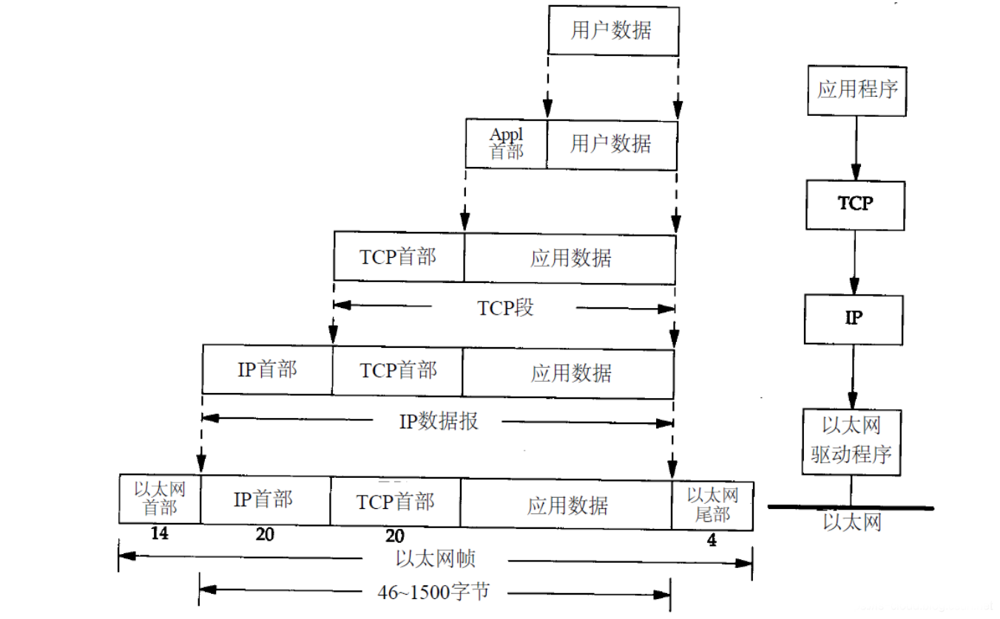
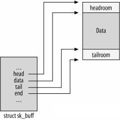
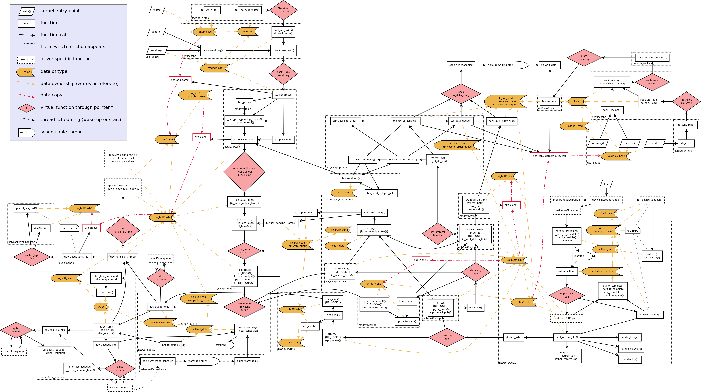
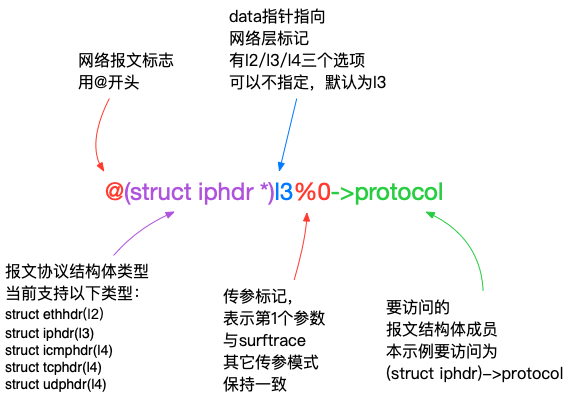
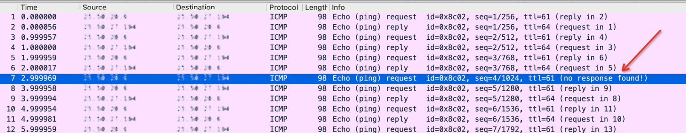
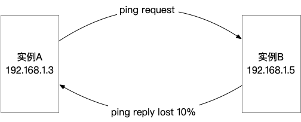
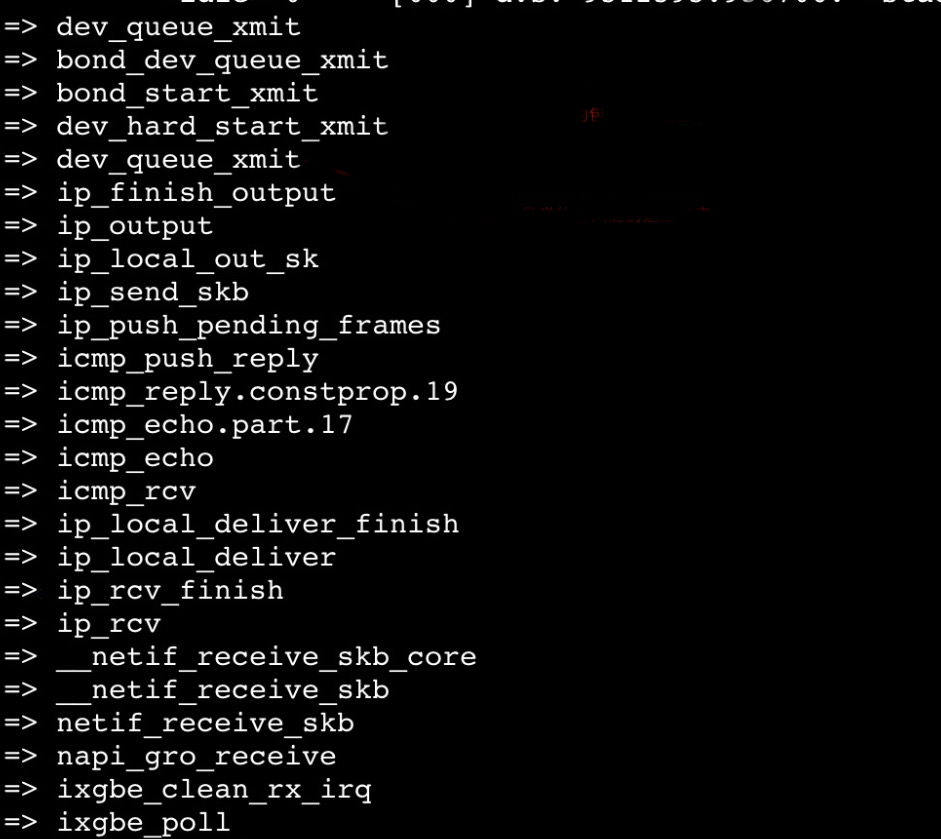
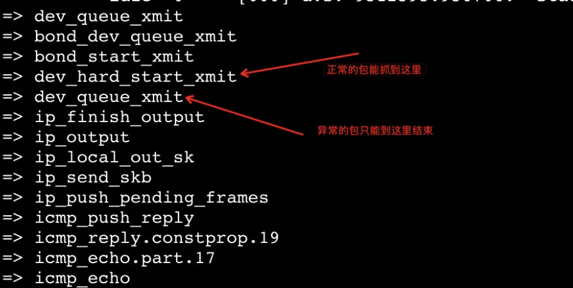
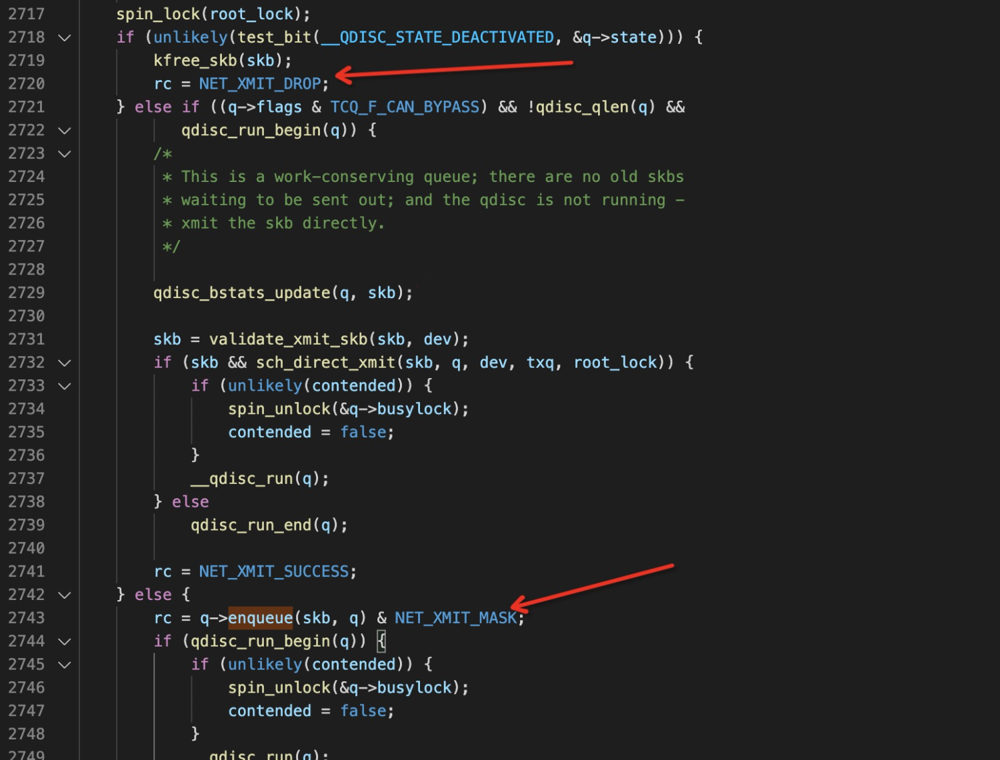
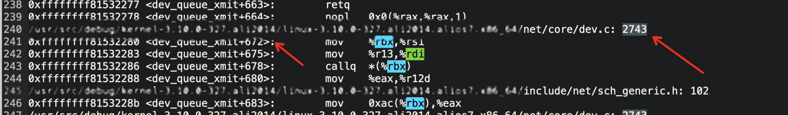

# 1、理解linux内核协议栈
&emsp;定位网络问题是一个软件开发者必备一项基础技能，诸如ping连通性、tcpdump抓包分析等手段，可以将对网络问题进行初步定界。然而，当问题进入内核协议栈内部，没有成型的工具使用的时候，就得要从内核协议栈层面着手追踪定位。

## 1.1、网络报文分层结构
&emsp;引用自《TCP/IP详解》卷一



&emsp;如上图所示，网络报文对数据报文数据在不同层进行封装；不同OS均采用一致的报文封装方式，达到跨软件平台通讯的目的。

## 1.2、sk_buff结构体
&emsp;sk_buff是网络报文在linux内核中的实际承载者，它在 <include/linux/skbuff.h> 文件中定义，结构体成员较多，本文不逐一展开。



&emsp;用户需要重点关注下面两个结构体成员:

```C
unsigned char *head, *data;
```
&emsp;其中head指向了数据区的开端，data指向了当前报文所在层的开头位置，如当前协议处理位于tcp层，data指针就会指向struct tcphdr;在ip层，则指向了struct iphdr。因此，data指针成员，是报文在内核处理过程中的关键信标。

## 1.3、内核网络协议栈地图
&emsp;下图协议栈处理地图，可以保存后放大观看，图片来源于网络。



&emsp;不难发现，上图中几乎所有函数都涉及到skb结构体处理，因此要想深入了解网络报文在内核的处理过程，skb->data应该就是最理想的引路蜂。

# 2、surftrace对网络报文增强处理

&emsp;surftrace基于ftrace封装，采用接近于C语言的参数语法风格，将原来繁琐的配置流程优化到一行命令语句完成，极大简化了ftrace部署步骤，是一款非常方便的内核追踪工具。但是要追踪网络报文，光解析一个skb->data指针是远远不够的。存在以下障碍：

- skb->data指针在不同网络层指向的协议头并不一致；
- 除了获取当前结构内容，还有获取上一层报文内容的需求，比如一个我们在udphdr结构体中，是无法直接获取到udp报文内容；
- 源数据呈现不够人性化。如ipv4报文ip是以一个u32数据类型，可读性不佳，过滤器配置困难。

&emsp;针对上述困难，surftrace对skb传参做了相应的特殊处理，以达到方便易用的效果。

## 2.1、网络协议层标记处理
&emsp;以追踪网协议栈报文接收的入口\_\_netif_receive_skb_core为例，函数原型定义：

```C
static int __netif_receive_skb_core(struct sk_buff *skb, bool pfmemalloc,  struct packet_type **ppt_prev);
```

&emsp;解析每个skb对应报文三次协议的方法：

```
surftrace 'p _netifreceiveskbcore proto=@(struct iphdr *)l3%0->protocol`
```
&emsp;协议成员获取方法为 @(struct iphdr *)l3%0->protocol



tips：

- 可以跨协议层向上解析报文结构体，如在l3层去分析struct icmphdr中的数据成员；
- 不可以跨协议层向下解析报文结构体，如在l4层去分析struct iphdr中的成员；

## 2.2、扩充下一层报文内容获取方式
&emsp;surftrace为ethhdr, iphdr, icmphdr, udphdr, tcphdr结构体添加了xdata成员，用于获取下一层报文内容。xdata有以下5类类型：

|  数据 | 数据类型 | 数据长度（字节） |
| ------- | ------- | ------ |
| cdata | unsgined char [] | 1 |
| sdata | unsigned short [] | 2 |
| ldata | unsigned int [] | 4 |
| qdata | unsigned long long [] | 8 |
| Sdata | char* [] | 字符串 |

&emsp;数组下标是按照位宽进行对齐的，比如要提取icmp报文中的2~3字节内容，组成一个unsigned short的数据，可以通过以下方法获取：

```bash
data=@(struct icmphdr*)l3%0->sdata[1]
```

## 2.3、ip和大小端模式转换
&emsp;网络报文字节序采取的是大端模式，而我们的操作系统一般采用小端模式；同时，ipv4采用了一个unsigned int数据类型来表示一个ip，而我们通常习惯采用 1.2.3.4 的方式来表示一个ipv4地址。上述差异导致直接去解读网络报文内容的时候非常费力。surftrace通过往变量增加前缀的方式，在数据呈现以及过滤的时候，将原始数据根据前缀命名规则进行转换，提升可读性和便利性。

| 前缀名 | 数据输出形式 | 数据长度(字节) |
| ----- | -------- | ----- |
| ip_ | a.b.c.d | ip字符串 |
| b16_ | 10进制 | 2 |
| b32_ | 10进制 | 4 |
| b64_ | 10进制 | 8 |
| B16_ | 16进制 | 2 |
| B32_ | 16进制 | 4 |
| B64_ | 16进制 | 8 |

## 2.4、牛刀小试
&emsp;我们在一个实例上抓到一个非预期的udp报文，它会往目标ip 10.0.1.221 端口号 9988 发送数据，想要锁定这个报文的发送进程。但由于udp是一种面向无连接的通讯协议，无法直接通过netstat等方式查询到发送者。
&emsp;用surftrace可以在ip_output函数处中下钩子：

```C
int ip_output(struct net *net, struct sock *sk, struct sk_buff *skb)
```
&emsp;追踪表达式：

```bash
surftrace 'p ip_output proto=@(struct iphdr*)l3%2->protocol ip_dst=@(struct iphdr*)l3%2->daddr b16_dest=@(struct udphdr*)l3%2->dest comm=$comm body=@(struct udphdr*)l3%2->Sdata[0] f:proto==17&&ip_dst==10.0.1.221&&b16_dest==9988'
```
&emsp;追踪结果：

```bash
surftrace 'p ip_output proto=@(struct iphdr*)l3%2->protocol ip_dst=@(struct iphdr*)l3%2->daddr b16_dest=@(struct udphdr*)l3%2->dest comm=$comm body=@(struct udphdr*)l3%2->Sdata[0] f:proto==17&&ip_dst==10.0.1.221&&b16_dest==9988'
echo 'p:f0 ip_output proto=+0x9(+0xe8(%dx)):u8 ip_dst=+0x10(+0xe8(%dx)):u32 b16_dest=+0x16(+0xe8(%dx)):u16 comm=$comm body=+0x1c(+0xe8(%dx)):string' >> /sys/kernel/debug/tracing/kprobe_events
echo 'proto==17&&ip_dst==0xdd01000a&&b16_dest==1063' > /sys/kernel/debug/tracing/instances/surftrace/events/kprobes/f0/filter
echo 1 > /sys/kernel/debug/tracing/instances/surftrace/events/kprobes/f0/enable
echo 0 > /sys/kernel/debug/tracing/instances/surftrace/options/stacktrace
echo 1 > /sys/kernel/debug/tracing/instances/surftrace/tracing_on
<...>-2733784 [014] .... 12648619.219880: f0: (ip_output+0x0/0xd0) proto=17 ip_dst=10.0.1.221 b16_dest=9988 comm="nc" body="Hello World\!
 @"
```
&emsp;通过上述命令，可以确定报文的发送的pid为2733784，进程名为nc。
 

# 3、实战：定位网络问题
&emsp;接下来我们从一个实际网络网络问题出发，讲述如何采用surftrace定位网络问题。
## 3.1、问题背景
&emsp;我们有两个实例中通讯存在性能问题，经抓包排查，确认性能上不去的根因是存在丢包导致的。幸运的是，该问题可以通过ping对端复现，确认丢包率在10%左右。



&emsp;通过进一步抓包分析，可以明确报文丢失在实例B内部。



&emsp;通过检查 /proc/net/snmp 以及分析内核日志，没有发现可疑的地方。

## 3.2、surftrace登场
&emsp;在1.1节的地图中，我们可以查到网络报文是内核由dev_queue_xmit函数将报文推送到网卡驱动。因此，可以在这个出口先进行probe，过滤ping报文，加上-s 选项，打出调用栈

```bash
surftrace 'p dev_queue_xmit proto=@(struct iphdr *)l2%0->protocol ip_dst=@(struct iphdr *)l2%0->daddr f:proto==1&&ip_dst==192.168.1.3' -s
```
&emsp;可以获取到以下调用栈：



&emsp;由于问题复现概率比较高，我们可以将怀疑的重点方向先放在包发送流程中，即从icmp_echo 函数往上，用surftrace每个符号都加一个trace点，看看回包到底消失在哪里。



## 3.3、锁定丢包点
&emsp;问题追踪到了这里，对于经验丰富的同学应该是可以猜出丢包原因。我们不妨纯粹从代码角度出发，再找一下准确的丢包位置。结合代码分析，我们可以在函数内部找到以下两处drop点：


&emsp;通过surftrace函数内部追踪功能，结合汇编代码信息，可以明确丢包点是出在了qdisc->enqueue钩子函数中。

```C
rc = q->enqueue(skb, q, &to_free) & NET_XMIT_MASK;
```
&emsp;此时，可以结合汇编信息：

&emsp;找到钩子函数存入的寄存名为bx，然后通过surftrace打印出来

```bash
surftrace 'p dev_queue_xmit+678 pfun=%bx'
```
&emsp;然后将pfun值在/proc/kallsyms查找匹配


&emsp;至此可以明确是htb qdisc导致丢包。确认相关配置存在问题后，将相关配置回退，网络性能得以恢复。


# 4、总结

&emsp;surftrace在网络层面的增强，用户只需要有相关的网络基础和一定的内核知识储备，就可以用较低编码工作量达到精准追踪网络报文在Linux内核的完整处理过程。适合用于追踪inux内核协议栈代码、定位深层次网络问题。