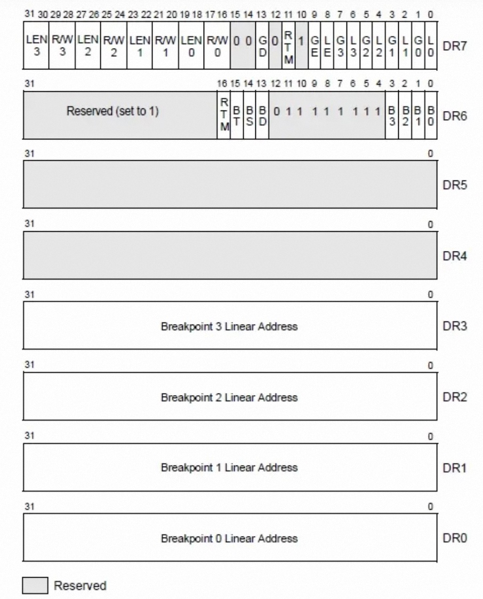
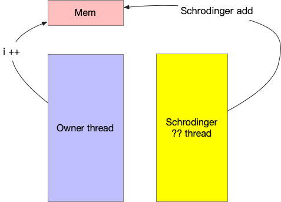
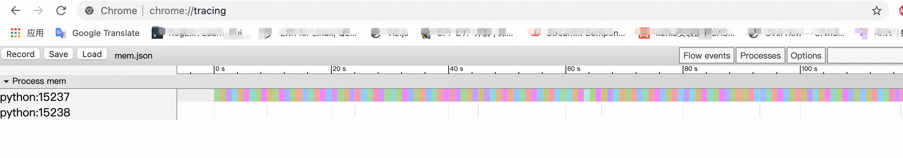
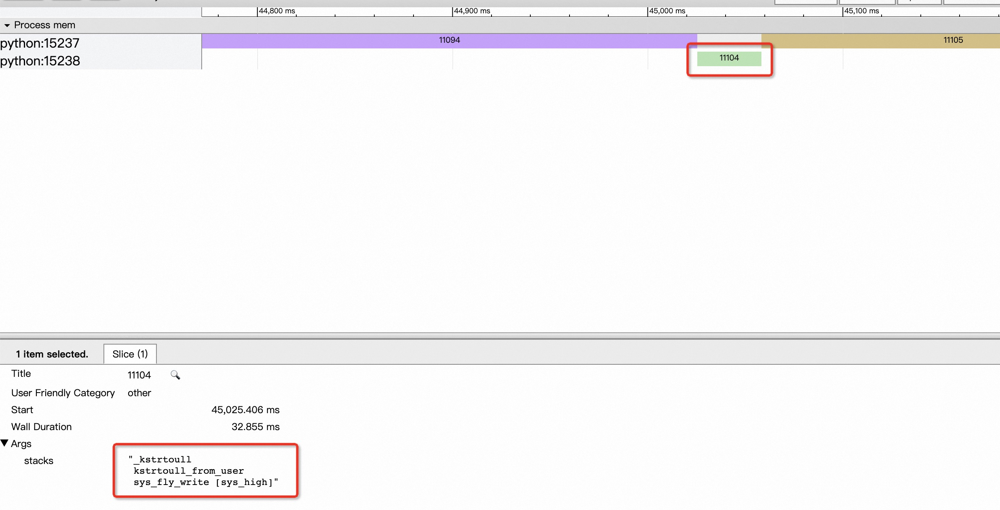

# 1、硬件断点(hardware breakpoint)
&emsp;顾名思义，即通过硬件逻辑实现的断点功能。我们常用的CPU均带有硬件数据断点功能，方便用于CPU层面的功能调试。以x86 架构为例，断点寄存器说明如下：



&emsp;通过配置DR7和D6寄存器即可以完成硬件断点配置。

## 1.1、支持事件类型
&emsp;与软件断点不同，硬件断点通常不会去修改原有的代码，并且可以指定小范围内存进行跟踪。通常支持以下断点事件：

1. 当特定的地址上有指令执行(X)的时候
2. 当特定的地址上有数据可以写入(W)的时候
3. 当特定的地址上有数据可以读取(R)的时候
4. 当特定的地址上有数据可以读写(R/W)的时候

&emsp;关于硬件数据断点的使用，可以参考 x86数据断点汇编手册：[http://x86asm.net/articles/debugging-in-amd64-64-bit-mode-in-theory/#Hardware-Breakpoints](http://x86asm.net/articles/debugging-in-amd64-64-bit-mode-in-theory/#Hardware-Breakpoints)

## 1.2、硬件断点优点

1. 不侵入修改原执行代码，简洁高效；
2. 覆盖内核态和用户态全量地址空间；
3. 支持读写事件追踪；
4. 配置流程相比软件断点、内存断点更为简单；

## 1.3、不足

1. 数量有限，受制于硬件资源限制，如x86架构中只有4硬件数据断点；
2. 监视范围有限，在64位系统中，单个硬件断点最多只能监视8字节数据；

## 1.4、典型应用

1. 定位内存飞踩问题：与栈溢出、数组越界、释放后访问等非法地址访问场景不同，内存飞踩访问的是合法的内存地址。这种情况导致常用的内存检查工具，如varglind、Asan、stack-protector等无法有效检测出该异常，导致此类问题定位极为困难。通过硬件断点，可以查到到对应内存的访问者，来锁定异常来源；
2. 深度观测应用执行过程：在明确了应用中的关键资源（如核心结构体、关键事件等）后，结合coolbpf 扩展断点应用，能够准确获取访问源的详细信息，如CPU号、进程pid、调用栈、发生时间等，再结合现场其它的关注数据，即可掌控应用的整体状态；

# 2、linux 对 硬件断点支持
&emsp;内核从2.6.38开始支持硬件断点，可以说当前主流内核版本均已支持。

## 2.1、内核支持示例
&emsp;可以参考内核代码中samples/hw\_breakpoint 目录下的代码，简要实现了硬件数据断点的功能。当然，用ko来实现硬件断点，对开发者要求较高，实现难度比较大；ko与内核绑定程度比较高，无法跨版本使用；而且功能风险也比较大，往往是关注的数据还没捕捉到，写的维测却把系统给宕掉了。

## 2.2、gdb
&emsp;在用户态可以通过 gdb watch 命令可以很便捷的配置用户态数据断点，比如要监视0x601000地址修改情况，可以通过以下方法配置。

```
(gdb) watch *(int *)0x601000
Hardware watchpoint 2: *(int *)0x601000
(gdb) continue
Continuing.

Hardware watchpoint 2: *(int *) 0x601000

Old value = 0
New value = 1
```

## 2.3、perf
&emsp;perf 可以同时配置用户态和内核态的数据断点，使用示例：

```
perf record  -e mem:0x410968:w -ag    
run_test  1689 [001] 12228.591637: mem:0x410968:w:
                   628 main+0xffffffffff800070 (/wp_test)
                 1f324 __libc_start_main+0xfffe0000cfd1c0dc (/lib/libc-2.24.so)
                   4b8 _start+0xffffffffff800028 (/wp_test)
```

&emsp;这是要监控所有用户态对虚拟地址0x410968写入事件，w表示写的时候触发， r表示读触发，默认是rw，x表示指令断点。
&emsp;更多的信息可以参考 perf list mem 部分描述。

# 3、coolbpf 对perf 硬件断点增强
&emsp;在第2节的支持列表中，我们不难发现已有应用要么基于内核实现，开发困难；要么基于命令行实现，想要深度挖掘一下实现起来代价非常高。coolbpf 通过针对 perf api 进行增强，让用户可以快速上手，深度观测内存层面的数据。

## 3.1、一个典型场景
&emsp;我们在工作中经常遇到内存数据出现非预期变化的情况，如下图所示:



&emsp;在内核态申请了一块内存（上方粉红色区域），首地址是一个用于计数器的区域，预期本应为一个单次自增1的操作，如左边的箭头所示。

&emsp;但是在实际的运行过程中，却发现计数器会偶发性自增不为1的情形，如右边箭头所示，该动作来源未知。


## 3.2、coolbpf 实现
&emsp;由于计数器是一个频繁自增的动作，通过单次硬件断点来捕捉非法行为如同大海捞针，可以结合coolbpf 将整个内存变化过程追踪下来，用于后续异常流程分析。源码可以参考：[https://gitee.com/anolis/coolbpf/blob/master/lcc/pylcc/pytool/perfMemFly.py](https://gitee.com/anolis/coolbpf/blob/master/lcc/pylcc/pytool/perfMemFly.py)

### 3.2.1、bpf 部分代码实现
&emsp;bpf代码主要是记录当前内存数值、进程名、pid和瞬时时间以及调用栈信息，并发给用户态处理：

```
SEC("perf_event")
int bpf_prog(struct bpf_perf_event_data *ctx)
{
    struct data_t data = {};
    u64* addr = (u64*)(ctx->addr);
    
    data.stack_id = bpf_get_stackid(ctx, &call_stack, KERN_STACKID_FLAGS);
    data.pid = bpf_get_current_pid_tgid() >> 32;
    bpf_get_current_comm(&data.comm, 16);
    
    data.ts = bpf_ktime_get_ns();
    data.addr = ctx->addr;
    data.value = _(*addr);
    
    bpf_perf_event_output(ctx, &e_out, BPF_F_CURRENT_CPU, &data, sizeof(data));
    return 0;
}
```

### 3.2.2、perf 事件注入
&emsp;数据断点参考 perf 文档 [https://man7.org/linux/man-pages/man2/perf_event_open.2.html](https://man7.org/linux/man-pages/man2/perf_event_open.2.html) 说明，将获取到的内核指针配置进去即可：

```
        pfConfig = {
            "type": PerfType.BREAKPOINT,
            "size": PERF_ATTR_SIZE_VER5,
            "sample_period": 1,
            "precise_ip": 2,
            "wakeup_events": 1,
            "bp_type": PerfBreakPointType.W,
            "bp_addr": addr,
            "bp_len": 8,
        }
        self.attachAllCpuPerf("bpf_prog", pfConfig, flags=PerfFlag.FD_CLOEXEC)
```

### 3.2.3、用户数据处理
&emsp;当数据断点采用到的数据送达用户态后，可以将结果保存到python list 中，追踪结束后导出到结果文件

```
        d = {"name": str(e.value),
             "pid": "mem",
             "tid": "%s:%d" % (e.comm, e.pid),
             "ph": "B",
             "ts": now - self._beg,
             "args": {"stacks": "\n".join(getKStacks(self.maps['call_stack'], e.stack_id, self._ksym))}
             }
        self._arr.append(d)
```

## 3.3、数据呈现
&emsp;观测进程停止后，会将结果以trace event的格式输出到指定文件。该格式非常容易理解并实现，参考以下示例文本：

```
[ {"name": "Asub", "ph": "B", "pid": 22630, "tid": 22630, "ts": 829},
  {"name": "Asub", "ph": "E", "pid": 22630, "tid": 22630, "ts": 833} ]
```
&emsp;每行即为一个Event，包含以下部分：

```
{
  "name": "myName", // 事件名，会展示在 timeline 上
  "ph": "B", // phase，事件类型
  "ts": 12345, // 事件发生时的时间戳，以微秒表示
  "pid": 123, // 进程名
  "tid": 456, // 线程名
  "args": { // 额外参数，当选中某个 event 后，会在底部的面板展示
    "someArg": 1,
    "anotherArg": {
      "value": "my value"
    }
  }
}
```
&emsp;更详细的信息可以参考：

* tracing工具说明：[https://www.chromium.org/developers/how-tos/trace-event-profiling-tool/](https://www.chromium.org/developers/how-tos/trace-event-profiling-tool/)
* 格式说明：[https://docs.google.com/document/d/1CvAClvFfyA5R-PhYUmn5OOQtYMH4h6I0nSsKchNAySU/edit#](https://docs.google.com/document/d/1CvAClvFfyA5R-PhYUmn5OOQtYMH4h6I0nSsKchNAySU/edit#)

&emsp;将结果取到本地后，用chrome 浏览器的 tracing 窗口导入，即可获取到整个阶段数据时间线，直观可以看到共有两个线程操作了指定内存区域。



&emsp;展开时间线深入分析可以的出15238进程存在异常写动作，并有相关调用栈信息；进一步分析调用栈即可锁定异常写入的元凶。



# 4、总结
&emsp;perf拥有强大的事件注入能力，coolbpf 拥有灵活高效的数据处理能力和直观的数据呈现能力。两者有机结合，挖掘到第一手的深度数据，高效地分析并精准溯源，让原来千头万绪的内存飞踩问题变得井井有条。我们还将带来更多深度的案例分享，敬请期待。


