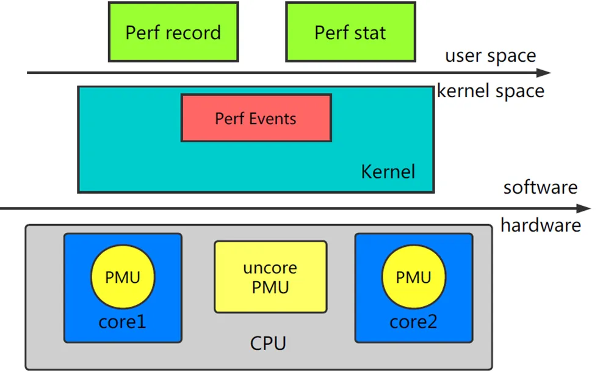
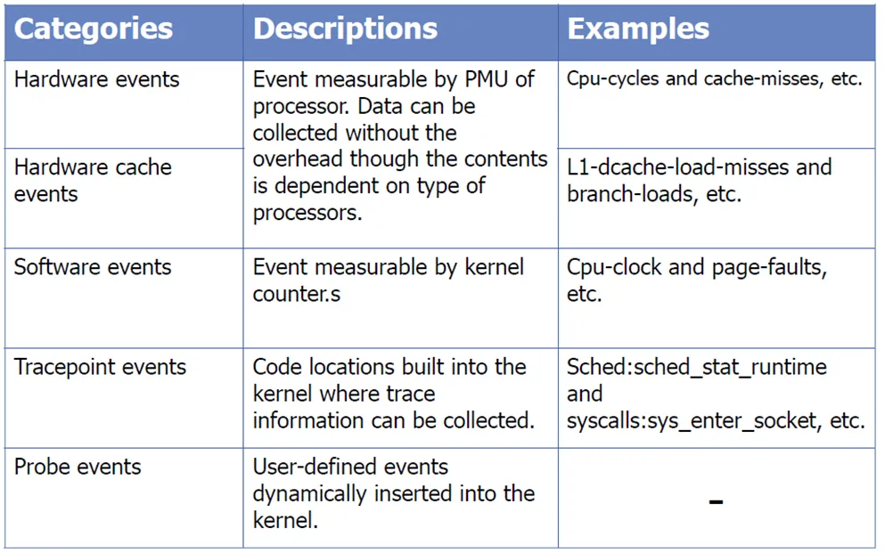
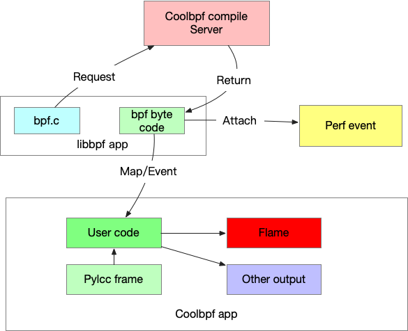
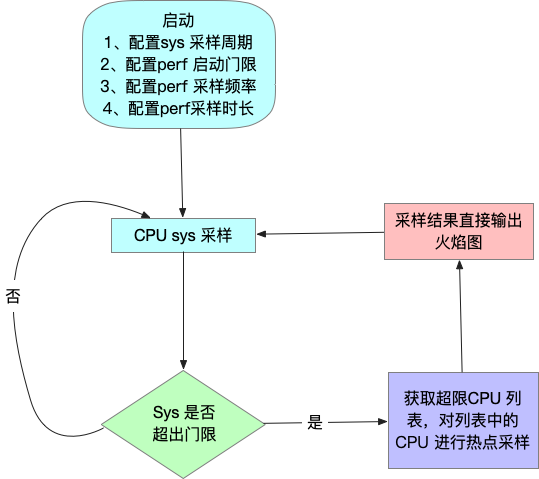
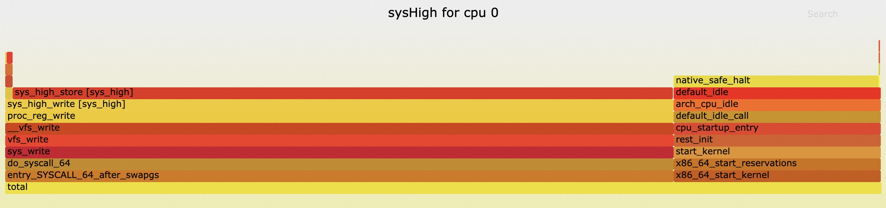

# 1、perf 简介
&emsp;Perf 是内置于 Linux 内核源码树中的性能剖析（profiling）工具。它基于事件采样的原理，以性能事件为基础，支持针对处理器相关性能指标与操作系统相关性能指标的性能剖析。

## 1.1、perf 框架


&emsp;主要有两部分组成

1. Perf Tools：用户态的 Perf Tools 为用户提供了一系列丰富的工具集用于收集、分析性能数据。
2. Perf Event Subsystem：Perf Event 子系统是内核众多子系统中的一员，其主要功能是和 Perf Tool 共同完成数据采集的工作。另外，Linux Hard Lockup Detector 也是通过 Perf Event 子系统来实现的。

&emsp;本文将重点围绕 Perf Event 子系统展开介绍coolbpf 在perf 事件中的增强。

## 1.2、perf 事件分类



## 1.3、当前perf 工具集中的不足

&emsp;当前perf工具以命令行为主，缺乏完善的第三方应用开发sdk，导致perf功能虽然强大，但是功能相对比较封闭，无法适应特定场景的问题。比如说常见的CPU system 占用率高的问题，我们通常使用perf record 来记录系统热点，再通过 FlameGraph 工具转换成火焰图进行分析。该方法存在以下不足：

1. sys占用率高很有可能只是偶发性问题，通过监控发现了以后再来执行命令，现象很有可能已经消失，持续性追踪会导致样本数太大，无法凸显出热点函数；
2. sys占用率高只是部分cpu现象，具体cpu编号并不确定，导致定向抓取事件操作步骤会变得非常繁琐；
3. perf 命令只能输出中间文件，要生成常用的火焰图数据还需要手工转换；

# 2、coolbpf 针对perf 增强
&emsp;coolbpf 为perf 提供了应用开发SDK，让开发者可以基于bpf快速开发 perf 应用。

## 2.1、coolbpf perf 组织架构



&emsp;大致流程和常规的coolbpf 应用开发过程基本一致。主要分为 

* libbpf 应用、
* perf 事件处理、
* 用户态处理、
&emsp;接下来我们以 [testPerf.py](https://gitee.com/anolis/coolbpf/blob/master/lcc/pylcc/guide/testPerf.py)为例，讲解perf 典型应用开发。

## 2.2、bpf 应用部分
&emsp; bpf 应用和其它的kprobe/tp代码实现并无明显差别:

```
#include "lbc.h"

SEC("perf_event")
int bpf_prog(struct bpf_perf_event_data *ctx)
{
    bpf_printk("hello perf\n");
    return 0;
}

char _license[] SEC("license") = "GPL";
```

## 2.3、perf event 
&emsp;coolbpf 对perf\_attr 做了python 化处理，故使用在配置 perf attr的时候，只需要参考  [perf 官方文档](https://man7.org/linux/man-pages/man2/perf_event_open.2.html) 中关于attr 配置说明进行配置即可。下面的例子是追踪 perf PAGE\_FAULTS事件的方法。

```
	pfConfig = {
            "sample_freq": 50, 
            "freq": 1,
            "type": PerfType.SOFTWARE,
            "config": PerfSwIds.PAGE_FAULTS,
        }
        self.attachPerfEvent("bpf_prog", pfConfig)
```
&emsp;此时系统中的 perf PAGE\_FAULTS 事件就可以跟2.2 节的libbpf 代码关联起来。

## 2.4、用户态处理
&emsp;本示例是将捕捉到的事件输出到 /sys/kernel/debug/tracing/trace\_pipe。用户可以根据自己的情况去执行event 回调或者分析maps 信息。

# 3、实战应用
&emsp;根据1.3 节的应用场景，需要追踪一个偶发性sys 冲高问题。在常规perf 使用存在困难的情况下，可以基于coolbpf快速开发一个sys 高 追踪服务，代码总共不超过180行，具体实现可以参考：[perfSys.py](https://gitee.com/anolis/surftrace/blob/master/tools/pylcc/pytool/perfSys.py)

&emsp;应用实现流程图如下：



&emsp;可以直接追踪到对应的写入行为


&emsp;通过上述方法，可以将原本需要花费多日守候才有可能捕捉到现场的问题，缩短到完全无人值守，问题复现瞬间即可锁定目标的小case。

# 4、总结
&emsp;coolbpf 融合了libbpf灵活、高效、安全的优势；结合perf强大的数据收集能力；并自身拥有快速部署、资源高效利用、结果直观可视化输出能力。多项优势结合，可在系统调优等场景中……（写不下去了，帮忙补充一下）
